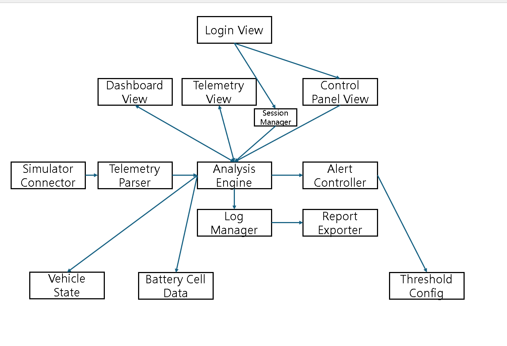
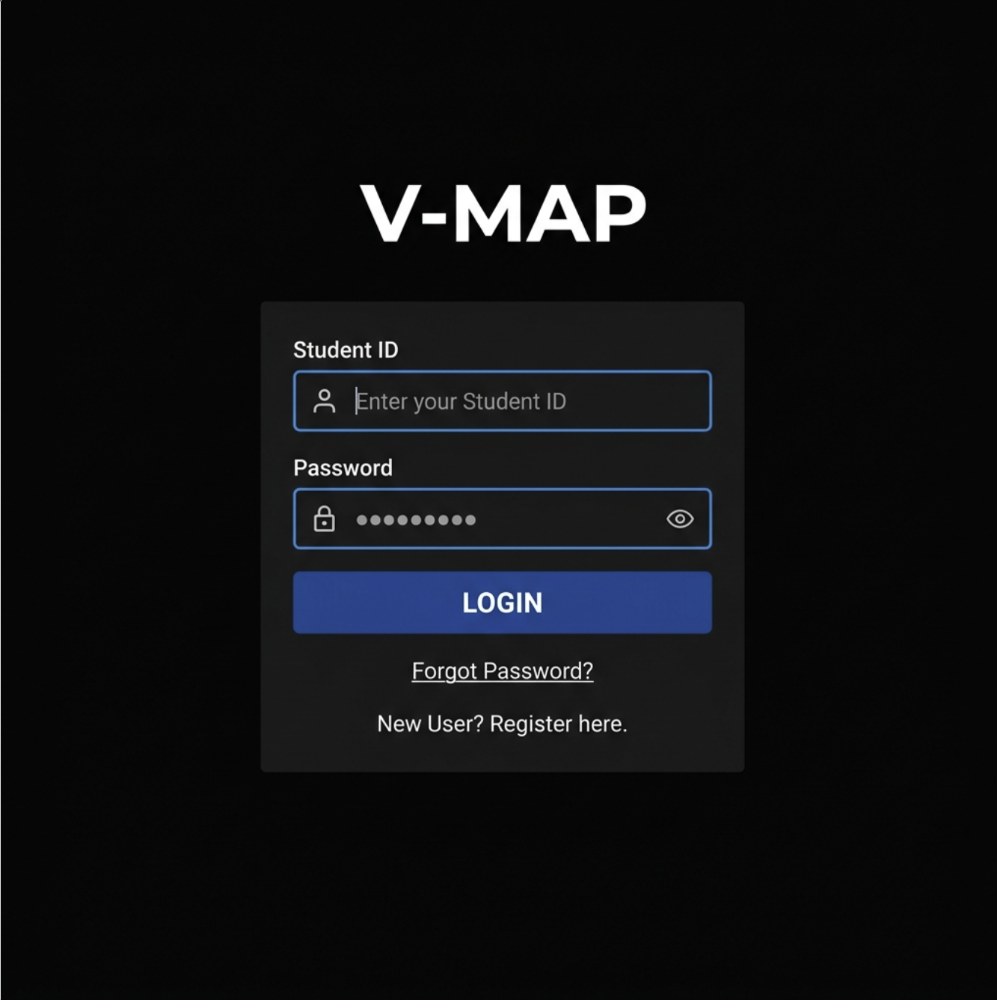
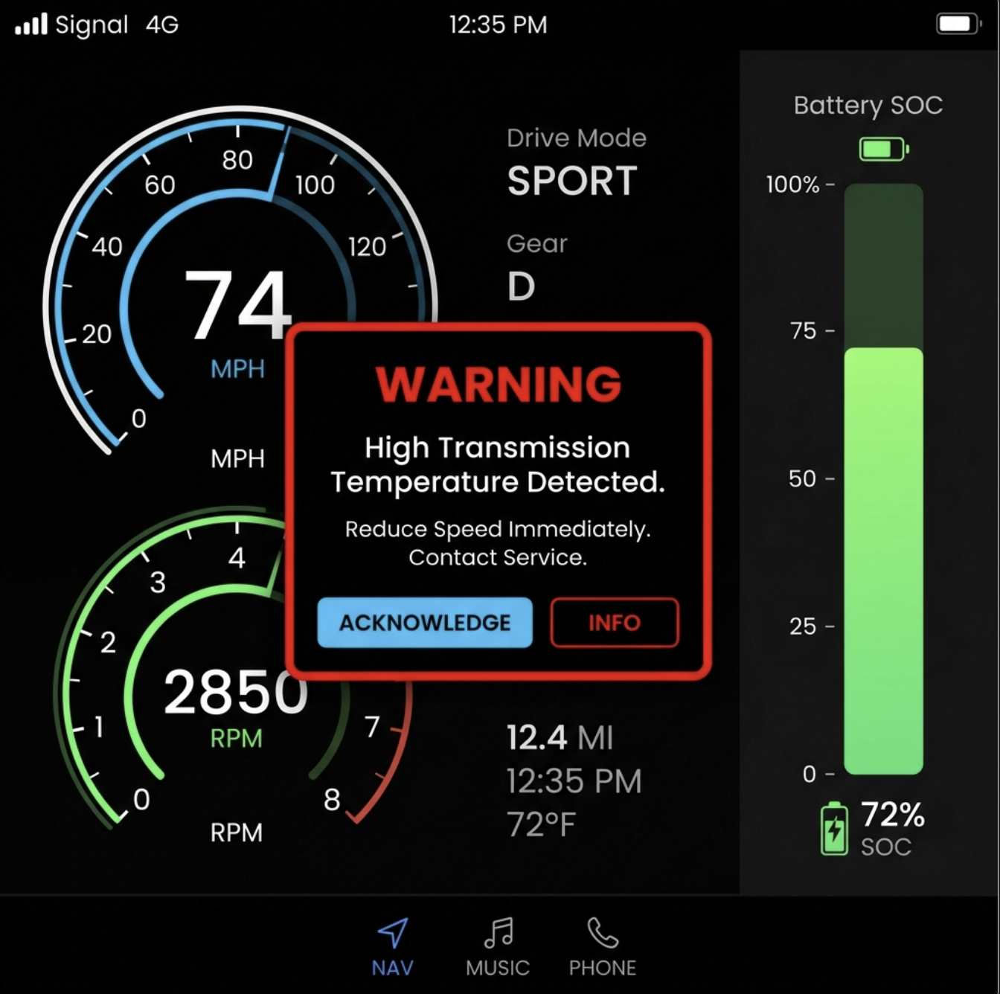
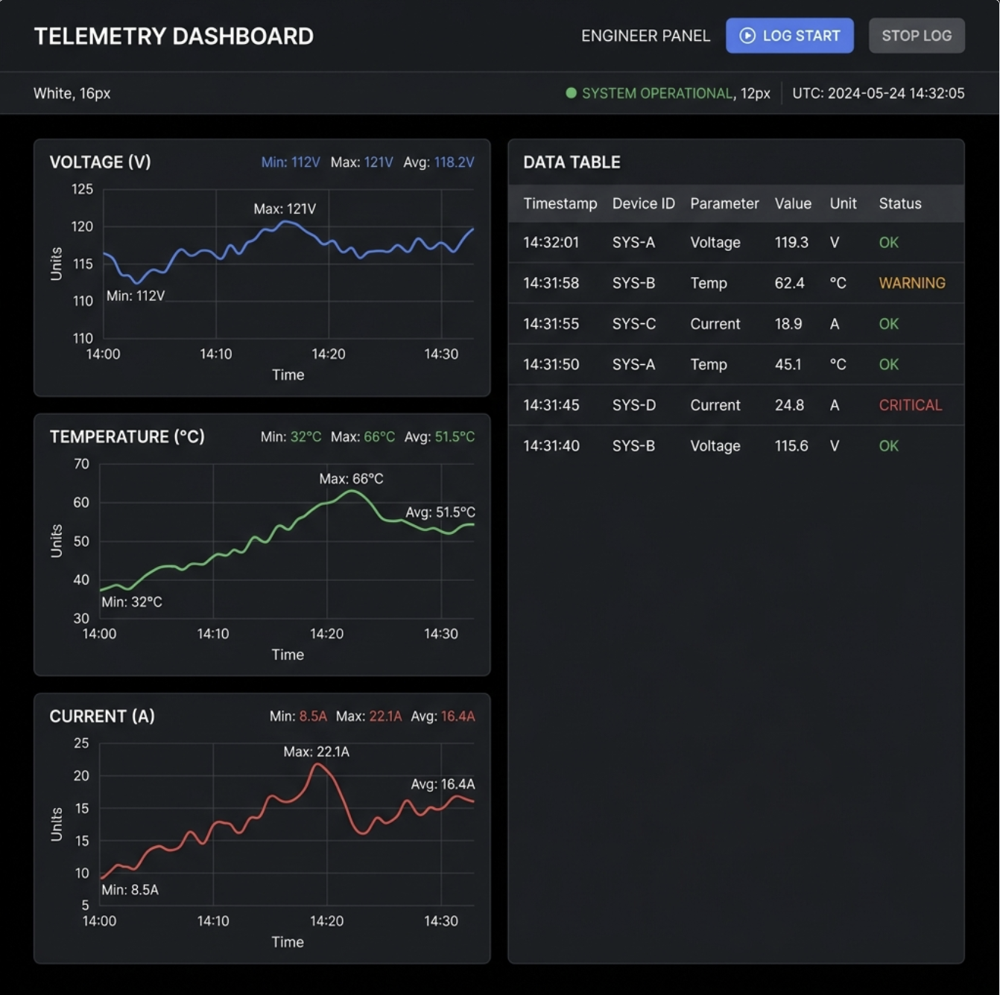
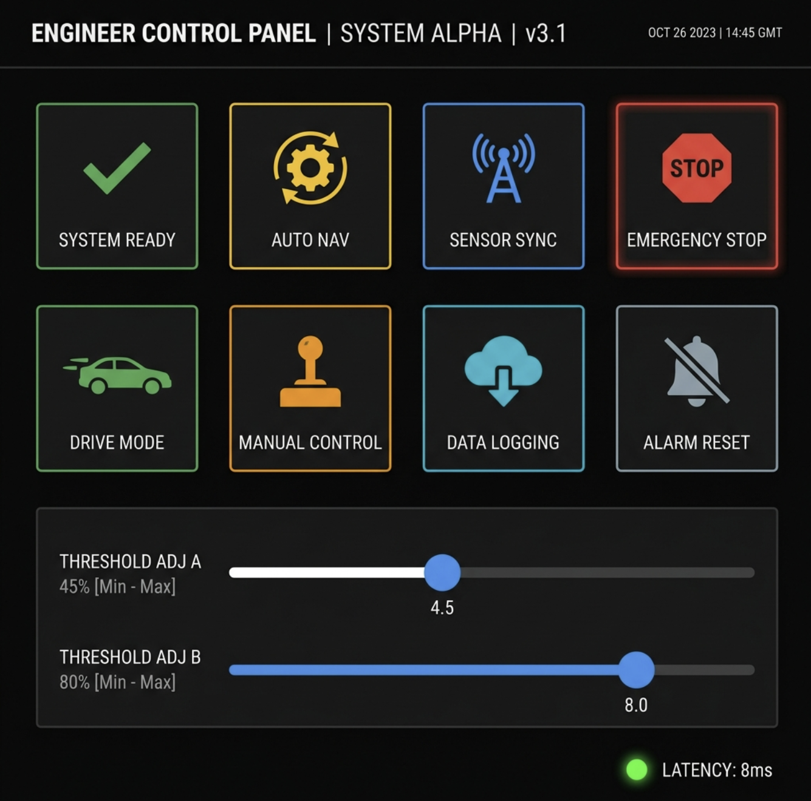

# 2. Analysis

## V-MAP

(22411985, 정수영, sy.jeong100@gmail.com, <https://github.com/suyeong-jeong/V-MAP>)

[ Revision history ]

| **Revision date** | **Version #** | **Description** | **Author** |
| :--- | :--- | :--- | :--- |
| 20/03/2026 | 0.0.1 | 초안 작성 | 정수영 |
| 26/03/2026 | 0.0.2 | uses case 추가 | 정수영 |
| 08/05/2026 | 0.0.3 | Analysis 작성 | 정수영 |

# = Contents =

### 1. Introduction ..................................................................................
### 2. Use case analysis .........................................................................
### 3. Domain analysis ..........................................................................
### 4. User Interface prototype ............................................................
### 5. Glossary ........................................................................................
### 6. References ....................................................................................

  

# 1. Introduction

## 1.1. 개요 (Overview)
본 문서는 실시간 차량 모니터링 및 분석 플랫폼인 V-MAP(Vehicle Monitoring & Analysis Platform)의 분석 설계 단계를 기술합니다. 이전 [Conceptualization] 단계에서 정의된 요구사항을 바탕으로, 시스템의 기능적 구조를 구체화하기 위한 유스케이스 분석, 상세 명세서, 분석 클래스 다이어그램 및 객체 간의 상호작용을 포함하며, 실제 구현 단계의 핵심 지침서 역할을 수행합니다.

## 1.2. 프로젝트 주요 특징 (Prominent Features)
* **유용성**: 실제 차량 하드웨어나 고가의 텔레메트리 장비 없이도 가상 시뮬레이터를 통해 차량 데이터를 실시간으로 관제할 수 있는 환경을 제공합니다. 드라이버에게는 안전 주행 정보를, 엔지니어에게는 정밀 분석 데이터를 각각 최적화된 인터페이스로 제공하여 활용도를 극대화합니다.

* **중요성**: 자동차 산업의 패러다임이 소프트웨어 중심 자동차(SDV)로 변화함에 따라, 소프트웨어를 통한 차량 제어 및 데이터 관리 역량은 필수적입니다. 본 프로젝트는 데이터 통신 프로토콜 설계와 실시간 처리 로직을 직접 구현함으로써 미래 모빌리티 소프트웨어 핵심 기술을 학습하는 데 의의가 있습니다.

* **확장성**: 모듈화된 설계를 기반으로 제작되어 향후 다양한 통신 프로토콜이나 새로운 센서 데이터 항목이 추가되더라도 시스템의 큰 변경 없이 유연하게 기능을 확장할 수 있습니다.

  

# 2. Use case analysis

## 2.1. Use Case Diagram 분석
본 다이어그램은 V-MAP 시스템의 **13가지 핵심 기능**을 정의합니다. 
* **보안**: 모든 주요 제어 및 관제 기능은 보안을 위해 `Login` 기능을 포함하도록 설계하였습니다.
* **대응 구조**: 이상 징후 발생 시 드라이버와 엔지니어에게 알림을 제공하는 기능을 `extend` 관계로 설정하여 시스템의 유연한 대응 구조를 명시하였습니다.

## 2.2 Use Case Description

| **구분** | **항목** | **내용** |
| --- | --- | --- |
| **제목** | **Use Case #1** | **Login (시스템 로그인)** |
| **GENERAL CHARACTERISTICS** | **Summary** | 등록된 사용자가 시스템의 자원에 접근하기 위해 신원(ID/PW)을 확인받고 권한을 획득하는 기능 |
|  | **Scope** | V-MAP SYSTEM |
|  | **Level** | User Level |
|  | **Author** | 정수영 |
|  | **Last Update** | 2026-05-08 |
|  | **Status** | Analysis |
|  | **Primary Actor** | Driver, Engineer |
|  | **Preconditions** | 사용자가 시스템 접속 후 메인 로그인 인터페이스가 활성화된 상태여야 한다. |
|  | **Trigger** | 시스템의 모니터링 및 제어 기능을 활성화하기 위해 인증이 요청될 때 |
|  | **Success Post Condition** | 사용자 인증이 성공하여 세션이 생성되고, 역할에 맞는 초기 화면으로 진입한다. |
|  | **Failed Post Condition** | 인증 실패 메시지가 출력되며, 시스템 접근이 차단된 상태로 로그인 화면에 잔류한다. |
| **MAIN SUCCESS SCENARIO** | **Step** | **Action** |
|  | **s** | 사용자가 시스템의 내부 데이터와 기능을 안전하게 사용하고 싶을 때 시작한다. |
|  | **1** | 사용자가 부여받은 ID와 비밀번호를 입력 필드에 작성한다. |
|  | **2** | 사용자가 Login 버튼을 클릭하여 시스템에 인증을 요청한다. |
|  | **3** | 시스템은 입력된 정보를 내부 사용자 데이터베이스와 대조하여 유효성을 검증한다. |
|  | **4** | 인증이 확인되면 시스템은 해당 사용자의 접근 권한(Driver 또는 Engineer)을 식별한다. |
|  | **5** | 시스템은 사용자의 역할에 따라 대시보드 또는 텔레메트리 관제 화면으로 전환한다. |
|  | **6** | 본 유스케이스는 사용자가 성공적으로 권한 화면으로 이동하면 종료된다. |
| **EXTENSION SCENARIOS** | **Step** | **Branching Action** |
|  | **3** | 3a. 입력된 ID 또는 비밀번호가 등록된 정보와 일치하지 않는 경우 |
|  |  | ...3a1. 시스템은 화면 상단에 "인증 정보가 올바르지 않습니다"라는 실패 메시지를 띄운다. |
|  |  | ...3a2. 보안을 위해 입력 필드를 초기화하고 사용자가 재입력할 수 있도록 유도한다. |
|  | **3** | 3b. 네트워크 장애로 인해 인증 서버와 통신이 불가능한 경우 |
|  |  | ...3b1. 시스템은 "서버 연결 오류"를 알리고 잠시 후 다시 시도할 것을 안내한다. |
| **RELATED INFORMATION** | **Performance** | 사용자 정보 대조 및 화면 전환까지 총 3초 이내에 완료되어야 함. |
|  | **Frequency** | 시스템을 가동할 때마다 반드시 수행됨 |

| **구분** | **항목** | **내용** |
| --- | --- | --- |
| **제목** | **Use Case #2** | **View Dashboard (실시간 대시보드 조회)** |
| **GENERAL CHARACTERISTICS** | **Summary** | 주행 중인 차량의 속도, RPM, 배터리 잔량 등 핵심 주행 데이터를 드라이버가 직관적으로 파악할 수 있도록 시각화하여 제공하는 기능 |
|  | **Scope** | V-MAP SYSTEM |
|  | **Level** | User Level |
|  | **Author** | 정수영 |
|  | **Last Update** | 2026-05-08 |
|  | **Status** | Analysis |
|  | **Primary Actor** | Driver |
|  | **Preconditions** | 사용자가 로그인을 완료하여 시스템 접근 권한을 가진 상태여야 하며, 가상 차량 시뮬레이터와 통신이 연결되어 있어야 한다. |
|  | **Trigger** | 드라이버가 주행 모니터링을 시작하거나 메인 대시보드 화면으로 진입할 때 |
|  | **Success Post Condition** | 최신 주행 데이터가 대시보드 UI 요소(게이지, 디지털 수치 등)에 지연 없이 실시간으로 반영된다. |
|  | **Failed Post Condition** | 화면의 데이터 갱신이 멈추거나, 통신 오류 경고가 출력되어 현재 상태 확인이 불가능해진다. |
| **MAIN SUCCESS SCENARIO** | **Step** | **Action** |
|  | **s** | 드라이버가 주행 중인 차량의 상태를 실시간으로 모니터링하고자 할 때 시작한다. |
|  | **1** | 시스템은 가상 차량 시뮬레이터로부터 전송되는 원시 CAN 데이터를 실시간으로 수신한다. |
|  | **2** | 시스템 엔진(Core)은 수신된 데이터를 파싱하여 속도(km/h), RPM, 배터리 SOC(%) 등의 물리 값으로 변환한다. |
|  | **3** | 시스템은 변환된 수치를 대시보드 인터페이스로 전달하여 그래픽 요소를 업데이트한다. |
|  | **4** | 대시보드는 변환된 값에 맞춰 속도계 바늘의 각도나 숫자 텍스트를 즉각적으로 갱신한다. |
|  | **5** | 본 유스케이스는 주행이 종료되거나 사용자가 화면을 전환할 때까지 밀리초(ms) 단위로 반복 수행된다. |
| **EXTENSION SCENARIOS** | **Step** | **Branching Action** |
|  | **1** | 1a. 시뮬레이터와의 네트워크 연결이 끊겨 데이터 유입이 중단된 경우 |
|  |  | ...1a1. 시스템은 화면 중앙에 "통신 연결 끊김" 메시지를 표시하고 마지막 수신 데이터를 고정시킨다. |
|  | **2** | 2a. 데이터 파싱 중 설계 범위를 벗어난 비정상적인 수치가 유입된 경우 |
|  |  | ...2a1. 해당 수치를 무시하고 이전 정상 데이터 값을 유지하여 화면의 급격한 튐 현상을 방지한다. |
| **RELATED INFORMATION** | **Performance** | 데이터 수신부터 UI 반영까지의 총 지연 시간은 0.2초 이내를 유지해야 함. |
|  | **Frequency** | 주행 세션 동안 매우 빈번하게 발생 |

| **구분** | **항목** | **내용** |
| --- | --- | --- |
| **제목** | **Use Case #3** | **Generate Raw Data (원시 데이터 생성 및 전송)** |
| **GENERAL CHARACTERISTICS** | **Summary** | 가상 차량 시뮬레이터가 실제 주행 환경을 모사하여 원시 CAN 데이터를 생성하고 시스템 엔진으로 전송하는 기능 |
|  | **Scope** | V-MAP SYSTEM |
|  | **Level** | User Level |
|  | **Author** | 정수영 |
|  | **Last Update** | 2026-05-08 |
|  | **Status** | Analysis |
|  | **Primary Actor** | Virtual Vehicle Simulator |
|  | **Preconditions** | 시뮬레이터 엔진이 가동 중이며, 시스템 Core와 네트워크 통신이 가능한 상태여야 한다. |
|  | **Trigger** | 시스템 운영이 시작되거나 사용자가 실시간 데이터 수집 기능을 활성화할 때 |
|  | **Success Post Condition** | 생성된 원시 데이터 패킷이 손실 없이 시스템 Core에 도달하여 파싱 대기 상태가 된다. |
|  | **Failed Post Condition** | 데이터 전송이 중단되거나 규격에 맞지 않는 패킷이 생성되어 시스템에서 무시된다. |
| **MAIN SUCCESS SCENARIO** | **Step** | **Action** |
|  | **s** | 하드웨어 제약 없이 시스템의 로직을 검증하기 위해 가상 데이터를 공급하고자 할 때 시작한다. |
|  | **1** | 시뮬레이터는 설정된 주행 시나리오(속도 변화, 배터리 소모율 등)에 따라 센서 수치를 계산한다. |
|  | **2** | 생성된 수치를 정의된 CAN 프로토콜 규격에 맞춰 패킷화한다. |
|  | **3** | 시뮬레이터는 완성된 패킷을 정해진 전송 주기에 맞춰 시스템 Core로 송신한다. |
|  | **4** | 시스템 Core로부터 데이터 수신 확인 신호(ACK)를 받으면 다음 주기의 데이터를 준비한다. |
|  | **5** | 본 유스케이스는 시뮬레이터 가동이 중지되거나 데이터 전송이 종료될 때까지 반복된다. |
| **EXTENSION SCENARIOS** | **Step** | **Branching Action** |
|  | **3** | **3a. 네트워크 대역폭 부족으로 전송 지연이 발생하는 경우** |
|  |  | ...3a1. 시뮬레이터는 데이터 전송 우선순위를 재조정하여 핵심 데이터(속도, RPM)를 먼저 송신한다. |
|  | **3** | 3b. 패킷 생성 중 데이터 손상이 감지된 경우 |
|  |  | ...3b1. 해당 패킷을 폐기하고 오류 로그를 기록한 후 다음 정상 패킷부터 전송을 재개한다. |
| **RELATED INFORMATION** | **Performance** | 데이터 생성 및 패킷화 과정은 50ms 이내에 완료되어 실시간성을 확보해야 함. |
|  | **Frequency** | 시스템 운용 중 밀리초(ms) 단위로 상시 발생  |

| **구분** | **항목** | **내용** |
| --- | --- | --- |
| **제목** | **Use Case #4** | **Monitor Telemetry (상세 텔레메트리 모니터링)** |
| **GENERAL CHARACTERISTICS** | **Summary** | 엔지니어가 차량의 세부 센서 데이터(전압, 전류, 온도 등)를 실시간 그래프와 수치 데이터로 정밀 관제하는 기능 |
|  | **Scope** | V-MAP SYSTEM |
|  | **Level** | User Level |
|  | **Author** | 정수영 |
|  | **Last Update** | 2026-05-08 |
|  | **Status** | Analysis |
|  | **Primary Actor** | Engineer |
|  | **Preconditions** | 엔지니어가 시스템에 로그인되어 있어야 하며, 시뮬레이터로부터 전체 텔레메트리 패킷이 유입되고 있어야 한다. |
|  | **Trigger** | 엔지니어가 정밀 분석을 위해 텔레메트리 관제 탭을 선택하거나 특정 센서군을 조회할 때 |
|  | **Success Post Condition** | 모든 센서 항목의 실시간 수치가 시간 흐름에 따른 차트 및 테이블 형태로 지연 없이 출력된다. |
|  | **Failed Post Condition** | 데이터 갱신이 중단되어 정밀 분석이 불가능해지거나, 잘못된 데이터 매핑으로 인해 수치가 왜곡되어 표시된다. |
| **MAIN SUCCESS SCENARIO** | **Step** | **Action** |
|  | **s** | 엔지니어가 차량의 기계적/전기적 상태를 상세히 분석하고 문제 징후를 파악하고자 할 때 시작한다. |
|  | **1** | 시스템은 수신된 전체 데이터 패킷에서 각 센서별(BMS, Inverter, Motor 등) 세부 항목을 추출한다. |
|  | **2** | 시스템은 추출된 시계열 데이터를 실시간 그래픽 엔진을 통해 차트로 시각화한다. |
|  | **3** | 엔지니어는 화면에서 특정 센서 항목을 선택하여 확대하거나 데이터 로그를 실시간으로 확인한다. |
|  | **4** | 시스템은 초당 수십 회 이상의 고주파 데이터를 버퍼링하여 끊김 없는 그래프 렌더링을 유지한다. |
|  | **5** | 본 유스케이스는 엔지니어가 관제 화면을 종료하거나 로그아웃할 때까지 지속된다. |
| **EXTENSION SCENARIOS** | **Step** | **Branching Action** |
|  | **2** | **2a. 모니터링할 센서 데이터의 양이 과도하여 시스템 부하가 발생하는 경우** |
|  |  | ...2a1. 시스템은 화면 업데이트 주기를 자동으로 조절하여 시스템 안정성을 확보한다. |
|  | **3** | 3b. 특정 센서 데이터가 수신되지 않아 그래프에 공백이 발생하는 경우 |
|  |  | ...3b1. 해당 데이터 필드를 공란으로 표시하고, 통신 로그에 누락된 센서 ID를 기록하여 엔지니어에게 알린다. |
| **RELATED INFORMATION** | **Performance** | 대량의 실시간 데이터 처리 시 UI 응답 속도는 100ms 이내를 유지해야 함. |
|  | **Frequency** | 관제 세션 동안 지속적으로 실시간 발생  |

| **구분** | **항목** | **내용** |
| --- | --- | --- |
| **제목** | **Use Case #5** | **Send Commands (차량 원격 제어 명령 전송)** |
| **GENERAL CHARACTERISTICS** | **Summary** | 엔지니어가 소프트웨어 인터페이스를 통해 가상 차량의 조명, 주행 모드, 비상 정지 등 물리적 장치를 원격으로 제어하는 기능 |
|  | **Scope** | V-MAP SYSTEM |
|  | **Level** | User Level |
|  | **Author** | 정수영 |
|  | **Last Update** | 2026-05-08 |
|  | **Status** | Analysis |
|  | **Primary Actor** | Engineer |
|  | **Preconditions** | 엔지니어가 관리자 권한으로 로그인되어 있어야 하며, 가상 차량 시뮬레이터와 양방향 통신 세션이 활성화된 상태여야 한다. |
|  | **Trigger** | 엔지니어가 제어 패널에서 특정 제어 버튼을 클릭하거나 설정 값을 변경할 때 |
|  | **Success Post Condition** | 제어 명령 패킷이 시뮬레이터에 정상 도달하여 차량 상태가 변경되고, 변경된 결과가 시스템 UI에 피드백으로 표시된다. |
|  | **Failed Post Condition** | 명령이 전달되지 않거나 시뮬레이터가 명령 수행을 거부하며, 시스템은 오류 알림을 띄우고 이전 상태를 유지한다. |
| **MAIN SUCCESS SCENARIO** | **Step** | **Action** |
|  | **s** | 엔지니어가 차량의 특정 장치를 조작하거나 주행 환경 설정을 변경하고자 할 때 시작한다. |
|  | **1** | 엔지니어가 시스템의 제어 패널에서 원하는 제어 항목(예: 상향등 점등)을 선택한다. |
|  | **2** | 시스템은 해당 명령에 맞는 제어 프로토콜 패킷을 생성한다. |
|  | **3** | 시스템 엔진은 생성된 패킷을 네트워크를 통해 가상 차량 시뮬레이터로 즉시 전송한다. |
|  | **4** | 시뮬레이터는 수신된 명령을 수행하고, 수행 성공 여부를 담은 응답 패킷(ACK)을 시스템으로 회신한다. |
|  | **5** | 시스템은 응답을 확인한 후 제어 패널의 아이콘 상태를 변경하여 엔지니어에게 성공 피드백을 제공한다. |
| **EXTENSION SCENARIOS** | **Step** | **Branching Action** |
|  | **3** | 3a. 전송한 제어 명령에 대해 시뮬레이터로부터 응답이 없는 경우 |
|  |  | ...3a1. 시스템은 명령 재전송을 3회 시도한 후, 실패 시 "제어 명령 응답 시간 초과" 경고를 띄운다. |
|  | **4** | 4b. 시뮬레이터가 현재 차량 상태(예: 고장 상태)로 인해 명령 수행이 불가능하다고 응답한 경우 |
|  |  | ...4b1. 시스템은 "명령 수행 거부" 메시지와 함께 거부 사유를 화면에 출력한다. |
| **RELATED INFORMATION** | **Performance** | 명령 클릭 시점부터 시뮬레이터 응답 확인까지 총 0.5초 이내에 완료되어야 함. |
|  | **Frequency** | 주행 중 필요 시 발생  |

| **구분** | **항목** | **내용** |
| --- | --- | --- |
| **제목** | **Use Case #6** | **Save Drive Logs (주행 데이터 로깅 저장)** |
| **GENERAL CHARACTERISTICS** | **Summary** | 실시간으로 유입되는 차량의 텔레메트리 데이터를 사후 분석 및 검토를 위해 파일 시스템에 영구적으로 기록하는 기능 |
|  | **Scope** | V-MAP SYSTEM |
|  | **Level** | User Level |
|  | **Author** | 정수영 |
|  | **Last Update** | 2026-05-08 |
|  | **Status** | Analysis |
|  | **Primary Actor** | Engineer, File System |
|  | **Preconditions** | 시스템이 가상 시뮬레이터와 연결되어 데이터가 수신 중이어야 하며, 로컬 저장소에 쓰기 권한이 있어야 한다. |
|  | **Trigger** | 엔지니어가 데이터 기록(Log Start) 버튼을 클릭하거나 주행 세션이 시작될 때 |
|  | **Success Post Condition** | 수집된 데이터가 정의된 포맷(.csv, .log 등)으로 파일 시스템에 안전하게 저장된다. |
|  | **Failed Post Condition** | 파일 쓰기 오류로 인해 데이터가 누락되거나, 파일이 손상되어 저장되지 않는다. |
| **MAIN SUCCESS SCENARIO** | **Step** | **Action** |
|  | **s** | 엔지니어가 주행 중 발생하는 대량의 데이터를 파일로 남겨 추후 정밀 분석하고자 할 때 시작한다. |
|  | **1** | 엔지니어가 로깅 시작 버튼을 누르면 시스템은 현재 날짜와 시간을 기반으로 새 로그 파일을 생성한다. |
|  | **2** | 시스템 엔진은 실시간으로 유입되는 파싱된 데이터(속도, 전압 등)를 로그 버퍼에 순차적으로 담는다. |
|  | **3** | 시스템은 일정 간격마다 버퍼에 쌓인 데이터를 파일 시스템(File System)에 물리적으로 기록(Write)한다. |
|  | **4** | 엔지니어가 로깅 중지 버튼을 누르면 시스템은 버퍼의 남은 데이터를 모두 기록하고 파일을 닫는다(Close). |
|  | **5** | 본 유스케이스는 파일 저장이 완료되었다는 메시지를 엔지니어에게 출력하며 종료된다. |
| **EXTENSION SCENARIOS** | **Step** | **Branching Action** |
|  | **3** | 3a. 저장 공간(디스크 용량)이 부족하여 파일 쓰기가 불가능한 경우 |
|  |  | ...3a1. 시스템은 즉시 로깅을 중단하고 엔지니어에게 "디스크 용량 부족" 알림을 띄운다. |
|  | **3** | 3b. 파일 기록 중 시스템 예기치 못한 종료로 파일이 깨질 위험이 있는 경우 |
|  |  | ...3b1. 시스템은 자동 복구 기능을 활성화하여 종료 직전까지의 데이터를 최대한 보존한다. |
| **RELATED INFORMATION** | **Performance** | 대량의 실시간 I/O 발생 시에도 시스템 모니터링 속도에 영향을 주지 않아야 함. |
|  | **Frequency** | 주행 분석 세션당 1회 이상 발생  |

| **구분** | **항목** | **내용** |
| --- | --- | --- |
| **제목** | **Use Case #7** | **Playback Logs (과거 주행 데이터 재생)** |
| **GENERAL CHARACTERISTICS** | **Summary** | 파일 시스템에 저장된 과거 주행 로그 파일을 불러와 실제 주행 상황과 동일하게 대시보드 및 관제 화면에 재현하는 기능 |
|  | **Scope** | V-MAP SYSTEM |
|  | **Level** | User Level |
|  | **Author** | 정수영 |
|  | **Last Update** | 2026-05-08 |
|  | **Status** | Analysis |
|  | **Primary Actor** | Engineer, File System |
|  | **Preconditions** | 시스템에 분석 가능한 유효한 로그 파일(.csv, .log 등)이 저장되어 있어야 한다. |
|  | **Trigger** | 엔지니어가 과거 주행 복기를 위해 로그 재생 메뉴를 선택하고 특정 파일을 로드할 때 |
|  | **Success Post Condition** | 파일 내의 시계열 데이터가 시간 순서대로 UI에 복원되어 표시되며, 재생/일시정지 등의 제어가 가능해진다. |
|  | **Failed Post Condition** | 파일 로드 실패 메시지가 출력되거나 데이터 형식이 맞지 않아 화면에 수치가 비정상적으로 출력된다. |
| **MAIN SUCCESS SCENARIO** | **Step** | **Action** |
|  | **s** | 엔지니어가 실제 주행이 끝난 후, 특정 시점의 차량 상태를 다시 정밀하게 확인하고자 할 때 시작한다. |
|  | **1** | 엔지니어가 시스템의 '로그 재생' 메뉴에 진입하여 파일 탐색기를 통해 재생할 로그 파일을 선택한다. |
|  | **2** | 시스템은 파일 시스템으로부터 해당 파일을 읽어와 데이터 규격 및 무결성을 검사한다. |
|  | **3** | 시스템은 파일에 기록된 타임스탬프 간격에 맞춰 데이터를 순차적으로 파싱한다. |
|  | **4** | 파싱된 데이터는 실시간 모니터링 모드와 동일한 경로로 전달되어 대시보드와 그래프 UI를 갱신한다. |
|  | **5** | 본 유스케이스는 파일의 끝(EOF)에 도달하거나 엔지니어가 재생을 중지할 때까지 유지된다. |
| **EXTENSION SCENARIOS** | **Step** | **Branching Action** |
|  | **2** | 2a. 선택한 파일이 손상되었거나 지원하지 않는 데이터 포맷인 경우 |
|  |  | ...2a1. 시스템은 "유효하지 않은 파일 형식" 알림을 띄우고 파일 선택 단계로 돌아간다. |
|  | **3** | 3b. 대용량 로그 파일 로딩 중 메모리 부족 현상이 발생하는 경우 |
|  |  | ...3b1. 시스템은 데이터를 한꺼번에 로드하지 않고 스트리밍 방식으로 읽어들여 성능 저하를 방지한다. |
| **RELATED INFORMATION** | **Performance** | 파일 로드 시 3초 이내에 첫 데이터가 화면에 출력되어야 하며, 최대 2배속 이상의 재생을 지원해야 함. |
|  | **Frequency** | 주행 후 분석 및 피드백 세션 시 수시로 발생 |

| **구분** | **항목** | **내용** |
| --- | --- | --- |
| **제목** | **Use Case #8** | **Receive Alerts (임계값 초과 경고 알림 수신)** |
| **GENERAL CHARACTERISTICS** | **Summary** | 실시간 주행 데이터가 미리 설정된 안전 범위를 벗어날 경우, 드라이버와 엔지니어에게 즉각적인 시청각적 알림을 제공하여 사고를 예방하는 기능 |
|  | **Scope** | V-MAP SYSTEM |
|  | **Level** | User Level |
|  | **Author** | 정수영 |
|  | **Last Update** | 2026-05-08 |
|  | **Status** | Analysis |
|  | **Primary Actor** | Driver, Engineer |
|  | **Preconditions** | 시스템이 실시간 모니터링 모드여야 하며, 각 센서 항목별로 비교 대상인 임계값이 설정되어 있어야 한다. |
|  | **Trigger** | 센서 수치가 설정된 안전 임계값(상한/하한)을 초과하거나 미달하는 상황이 발생할 때 |
|  | **Success Post Condition** | 화면에 경고 팝업 및 시각적 강조(점멸 등)가 나타나고, 경고 발생 내역이 시스템 알람 로그에 즉시 기록된다. |
|  | **Failed Post Condition** | 임계값을 초과했음에도 알림이 발생하지 않거나 지연되어 사용자가 위험 상황을 인지하지 못한다. |
| **MAIN SUCCESS SCENARIO** | **Step** | **Action** |
|  | **s** | 시스템이 수신되는 모든 데이터의 안전성을 실시간으로 감시하고자 할 때 시작한다. |
|  | **1** | 시스템 엔진은 매 주기마다 파싱된 실시간 데이터 수치를 설정된 임계값 데이터베이스와 비교 연산한다. |
|  | **2** | 특정 센서(예: 배터리 온도, 모터 전류 등)의 수치가 안전 범위를 벗어난 것을 감지한다. |
|  | **3** | 시스템 UI는 해당 항목의 색상을 빨간색으로 변경하고, 화면 중앙에 경고 메시지 팝업을 출력한다. |
|  | **4** | 시스템은 경고 발생 시점의 시간, 센서 종류, 초과 수치를 알람 로그에 영구 기록한다. |
|  | **5** | 사용자가 알림을 확인하고 '확인' 버튼을 누르거나 수치가 정상 범위로 복귀하면 알림 상태가 해제된다. |
| **EXTENSION SCENARIOS** | **Step** | **Branching Action** |
|  | **3** | 3a. 여러 개의 센서에서 동시에 임계값 초과 경고가 발생하는 경우 |
|  |  | ...3a1. 시스템은 미리 정의된 우선순위(예: 배터리 화재 위험 > 속도 초과)에 따라 가장 위험한 항목을 최상단에 노출한다. |
|  | **4** | 4b. 알람 로그 기록 중 파일 시스템의 오류로 기록이 불가능한 경우 |
|  |  | ...4b1. 시스템은 휘발성 메모리 버퍼에 우선 기록하고, 네트워크나 저장소 상태가 복구되는 즉시 재기록을 시도한다. |
| **RELATED INFORMATION** | **Performance** | 임계값 초과 감지 시점부터 사용자 알림 출력까지 0.1초 이내에 완료되어야 함. |
|  | **Frequency** | 차량 이상 상태 또는 위험 주행 발생 시 수시 발생  |

| **구분** | **항목** | **내용** |
| --- | --- | --- |
| **제목** | **Use Case #9** | **Analyze Battery Cells (배터리 셀 상태 정밀 분석)** |
| **GENERAL CHARACTERISTICS** | **Summary** | 배터리 관리 시스템(BMS)에서 수신된 데이터를 바탕으로 개별 배터리 셀의 전압 편차와 밸런싱 상태를 정밀하게 분석하여 시각화하는 기능 |
|  | **Scope** | V-MAP SYSTEM |
|  | **Level** | User Level |
|  | **Author** | 정수영 |
|  | **Last Update** | 2026-05-08 |
|  | **Status** | Analysis |
|  | **Primary Actor** | Engineer |
|  | **Preconditions** | 엔지니어가 시스템에 로그인되어 있어야 하며, 시뮬레이터로부터 BMS 관련 상세 데이터 패킷이 정상적으로 수신되어야 한다. |
|  | **Trigger** | 엔지니어가 배터리 효율 진단 또는 안전 점검을 위해 '배터리 셀 분석' 메뉴를 선택할 때 |
|  | **Success Post Condition** | 배터리 팩 내 모든 개별 셀의 전압이 막대그래프 형태로 출력되고, 셀 간 최대 편차 및 위험 요소가 화면에 요약 표시된다. |
|  | **Failed Post Condition** | 셀 데이터 매핑 오류로 일부 셀 정보가 누락되거나, 전압 계산 수치가 비정상적으로 높게 혹은 낮게 출력되어 분석이 불가능해진다. |
| **MAIN SUCCESS SCENARIO** | **Step** | **Action** |
|  | **s** | 엔지니어가 배터리 수명 저하나 화재 위험을 방지하기 위해 셀 밸런싱 상태를 점검하고자 할 때 시작한다. |
|  | **1** | 시스템은 수신된 전체 텔레메트리 데이터 중 BMS 패킷을 분리하여 추출한다. |
|  | **2** | 시스템은 패킷 내에 포함된 수십 개의 개별 셀 전압 데이터를 배열 형태로 정렬한다. |
|  | **3** | 시스템은 각 셀의 전압을 비교하여 최대 전압 셀과 최소 전압 셀을 식별하고, 두 값 사이의 편차를 계산한다. |
|  | **4** | 시스템 UI는 계산된 전압 분포를 막대그래프로 시각화하고, 설정된 허용 편차 이내인지 여부를 색상으로 표시한다. |
|  | **5** | 본 유스케이스는 엔지니어가 분석 화면을 종료하거나 로그아웃할 때까지 실시간으로 업데이트되며 지속된다. |
| **EXTENSION SCENARIOS** | **Step** | **Branching Action** |
|  | **2** | 2a. 특정 셀의 데이터가 수신되지 않아 그래프에 결측치가 발생하는 경우 |
|  |  | ...2a1. 시스템은 해당 셀을 회색으로 표시하고 "Cell Data Missing" 경고를 기록하여 센서 연결 오류를 알린다. |
|  | **3** | 3b. 셀 간 전압 편차가 위험 수준(예: 0.5V 이상)으로 벌어진 것을 감지한 경우 |
|  |  | ...3b1. 시스템은 즉시 해당 셀을 강조 표시하고 엔지니어에게 "BMS 정밀 점검 필요" 팝업 알림을 송출한다. |
| **RELATED INFORMATION** | **Performance** | 대량의 셀 데이터를 파싱하여 그래프로 렌더링하는 과정은 0.5초 이내에 완료되어야 함. |
|  | **Frequency** | 배터리 상태 상시 모니터링 및 정기 점검 시 발생  |

| **구분** | **항목** | **내용** |
| --- | --- | --- |
| **제목** | **Use Case #10** | **Analyze Efficiency (전비 및 주행 효율 계산)** |
| **GENERAL CHARACTERISTICS** | **Summary** | 주행 중인 차량의 소비 전력 대비 이동 거리를 실시간으로 계산하여 전비(km/kWh) 및 에너지 효율 상태를 엔지니어에게 제공하는 기능 |
|  | **Scope** | V-MAP SYSTEM |
|  | **Level** | User Level |
|  | **Author** | 정수영 |
|  | **Last Update** | 2026-05-08 |
|  | **Status** | Analysis |
|  | **Primary Actor** | Engineer |
|  | **Preconditions** | 엔지니어가 로그인된 상태여야 하며, 차량의 전압, 전류, 속도 및 누적 주행 거리 데이터가 실시간으로 수신되어야 한다. |
|  | **Trigger** | 엔지니어가 차량의 성능 최적화를 위해 '주행 효율 분석' 메뉴를 활성화할 때 |
|  | **Success Post Condition** | 현재 주행 모드에 따른 실시간 전비 수치와 평균 주행 효율이 계산되어 화면에 시각적으로 표시된다. |
|  | **Failed Post Condition** | 연산에 필요한 데이터 누락으로 인해 효율 값이 '0' 또는 'N/A'로 출력되거나, 비정상적으로 높은 수치가 계산되어 분석 신뢰도가 떨어진다. |
| **MAIN SUCCESS SCENARIO** | **Step** | **Action** |
|  | **s** | 엔지니어가 현재 주행 시나리오에서의 에너지 효율을 분석하여 주행 전략을 수정하고자 할 때 시작한다. |
|  | **1** | 시스템은 수신된 텔레메트리 패킷에서 배터리 전압(V)과 전류(A)를 추출하여 실시간 소비 전력(W)을 연산한다. |
|  | **2** | 시스템은 현재 차량의 속도(km/h)와 주행 시간 데이터를 바탕으로 단위 시간당 이동 거리를 산출한다. |
|  | **3** | 소비된 총 전력량(Wh) 대비 주행 거리(km)를 계산하여 실시간 전비(km/kWh) 수치를 도출한다. |
|  | **4** | 시스템 UI는 계산된 효율 데이터를 실시간 숫자 및 주행 이력 그래프(Chart) 형태로 업데이트한다. |
|  | **5** | 본 유스케이스는 엔지니어가 분석 화면을 종료하거나 로그아웃할 때까지 1초 단위로 갱신되며 지속된다. |
| **EXTENSION SCENARIOS** | **Step** | **Branching Action** |
|  | **3** | 3a. 차량이 정차 중이어서 속도가 0인 상태에서 전력이 소비되는 경우 |
|  |  | ...3a1. 시스템은 전비 계산 시 분모가 0이 되지 않도록 예외 처리하며, '정차 중 에너지 대기' 상태로 표시한다. |
|  | **4** | 4b. 급가속 등으로 인해 전력 소비량이 일시적으로 임계 수치를 넘어서는 경우 |
|  |  | ...4b1. 시스템은 급격한 데이터 변동을 필터링하여 엔지니어가 평균적인 흐름을 파악할 수 있도록 보정한다. |
| **RELATED INFORMATION** | **Performance** | 복합적인 물리량 연산 과정은 데이터 수신 후 100ms 이내에 처리되어 실시간성을 확보해야 함. |
|  | **Frequency** | 에너지 효율 최적화 및 주행 전략 분석 시 지속적으로 발생 |

| **구분** | **항목** | **내용** |
| --- | --- | --- |
| **제목** | **Use Case #11** | **Set Thresholds (경고 알림 임계값 설정)** |
| **GENERAL CHARACTERISTICS** | **Summary** | 엔지니어가 차량의 각 센서 데이터별 안전 범위를 정의하거나 수정하여, 경고 알림(Alert)이 발생하는 기준 수치를 설정하는 기능 |
|  | **Scope** | V-MAP SYSTEM |
|  | **Level** | User Level |
|  | **Author** | 정수영 |
|  | **Last Update** | 2026-05-08 |
|  | **Status** | Analysis |
|  | **Primary Actor** | Engineer |
|  | **Preconditions** | 엔지니어 권한으로 로그인되어 있어야 하며, 시스템 설정 메뉴에 접근 가능한 상태여야 한다. |
|  | **Trigger** | 새로운 주행 시나리오에 맞는 안전 기준 설정이 필요하거나, 기존 임계값을 조정하여 모니터링 민감도를 변경하고자 할 때 |
|  | **Success Post Condition** | 입력된 임계값이 시스템 설정에 반영되어, 실시간 데이터 모니터링 시 즉시 새로운 경고 기준으로 작동한다. |
|  | **Failed Post Condition** | 입력값 오류로 설정 저장이 거부되거나, 시스템 오류로 인해 이전의 임계값 설정이 그대로 유지된다. |
| **MAIN SUCCESS SCENARIO** | **Step** | **Action** |
|  | **s** | 엔지니어가 주행 환경이나 차량 상태에 맞춰 최적의 안전 경고 기준을 수립하고자 할 때 시작한다. |
|  | **1** | 엔지니어가 시스템 설정 메뉴에서 '임계값 관리' 탭을 선택한다. |
|  | **2** | 시스템은 현재 모니터링 중인 모든 센서 항목(온도, 전압, 전류, 속도 등)과 현재 적용된 임계값을 리스트 형태로 출력한다. |
|  | **3** | 엔지니어가 수정을 원하는 항목의 입력 필드에 새로운 상한값 또는 하한값을 입력한다. |
|  | **4** | 엔지니어가 '설정 저장' 버튼을 클릭한다. |
|  | **5** | 시스템은 입력된 수치가 해당 센서의 물리적 측정 범위 내에 있는지 유효성 검사를 수행한다. |
|  | **6** | 검증이 완료되면 시스템은 새로운 값을 설정 파일에 저장하고, 실시간 모니터링 엔진의 비교 로직에 즉시 업데이트한다. |
|  | **7** | 시스템은 설정이 성공적으로 반영되었음을 알리는 팝업 메시지를 출력하며 종료된다. |
| **EXTENSION SCENARIOS** | **Step** | **Branching Action** |
|  | **5** | 5a. 입력된 수치가 데이터 타입을 만족하지 않거나 물리적으로 불가능한 범위를 입력한 경우 |
|  |  | ...5a1. 시스템은 해당 필드에 빨간색 강조 표시를 하고 "유효하지 않은 수치입니다"라는 가이드를 제공한다. |
|  | **6** | 6b. 설정 저장 과정에서 시스템 내부 저장소 오류가 발생한 경우 |
|  |  | ...6b1. 시스템은 저장 실패를 알리고, 현재 모니터링 엔진이 기존의 안전한 설정값을 유지하고 있음을 안내한다. |
| **RELATED INFORMATION** | **Performance** | 설정 변경 후 실시간 모니터링 로직에 반영되는 시간은 1초 이내여야 함. |
|  | **Frequency** | 주행 테스트 전 초기 세팅 시 또는 안전 기준 변경 시 발생  |

| **구분** | **항목** | **내용** |
| --- | --- | --- |
| **제목** | **Use Case #12** | **Check Latency (네트워크 지연시간 모니터링)** |
| **GENERAL CHARACTERISTICS** | **Summary** | 가상 차량 시뮬레이터와 시스템 사이의 데이터 전송 지연 시간을 실시간으로 측정하여 통신 환경의 안정성을 진단하는 기능 |
|  | **Scope** | V-MAP SYSTEM |
|  | **Level** | User Level |
|  | **Author** | 정수영 |
|  | **Last Update** | 2026-05-08 |
|  | **Status** | Analysis |
|  | **Primary Actor** | Engineer |
|  | **Preconditions** | 시스템이 네트워크를 통해 시뮬레이터와 연결된 상태여야 한다. |
|  | **Trigger** | 엔지니어가 통신 품질 확인을 위해 '네트워크 진단' 메뉴를 활성화하거나, 데이터 수신이 불안정하다고 판단될 때 |
|  | **Success Post Condition** | 현재의 왕복 지연 시간(RTT)이 밀리초(ms) 단위로 화면에 표시되며, 통신 품질 상태(Good/Fair/Poor)가 갱신된다. |
|  | **Failed Post Condition** | 지연 시간 측정이 불가능하여 '연결 없음'으로 표시되거나, 수치가 비정상적으로 높게 출력되어 분석 신뢰도가 떨어진다. |
| **MAIN SUCCESS SCENARIO** | **Step** | **Action** |
|  | **s** | 엔지니어가 실시간 제어 및 모니터링에 지장을 주는 통신 지연이 있는지 확인하고자 할 때 시작한다. |
|  | **1** | 시스템 엔진은 주기적으로 시뮬레이터에 '품질 확인용 데이터 패킷'을 전송한다. |
|  | **2** | 시뮬레이터로부터 해당 패킷에 대한 응답을 수신하는 즉시, 송신 시점과 수신 시점의 차이를 계산한다. |
|  | **3** | 시스템은 계산된 RTT 값을 바탕으로 네트워크의 지연 시간 및 패킷 손실률을 산출한다. |
|  | **4** | 시스템 UI는 측정된 지연 시간을 그래프로 시각화하고, 현재의 통신 등급을 엔지니어 화면 하단에 상시 노출한다. |
|  | **5** | 본 유스케이스는 엔지니어가 진단 화면을 종료하거나 시스템이 종료될 때까지 반복적으로 수행된다. |
| **EXTENSION SCENARIOS** | **Step** | **Branching Action** |
|  | **2** | 2a. 설정된 타임아웃(예: 1000ms) 이내에 응답 패킷이 도착하지 않는 경우 |
|  |  | ...2a1. 시스템은 해당 주기의 데이터를 'Packet Loss'로 처리하고, 연속 발생 시 "통신 장애 위험" 경고를 발생시킨다. |
|  | **3** | 3b. 지연 시간이 제어 가능한 임계치(예: 500ms)를 초과한 경우 |
|  |  | ...3b1. 시스템은 지연 시간 수치를 빨간색으로 점멸시켜 엔지니어에게 현재 제어 명령 전송이 위험할 수 있음을 알린다. |
| **RELATED INFORMATION** | **Performance** | 지연 시간 측정 오차는 ±5ms 이내여야 하며, UI 갱신은 1초 단위로 이루어져야 함. |
|  | **Frequency** | 시스템 가동 중 백그라운드에서 상시 또는 엔지니어 요청 시 발생  |

| **구분** | **항목** | **내용** |
| --- | --- | --- |
| **제목** | **Use Case #13** | **Export Reports (주행 분석 보고서 출력)** |
| **GENERAL CHARACTERISTICS** | **Summary** | 주행 중 수집된 로그 데이터와 분석 결과(전비, 셀 상태 등)를 정돈된 문서 형식(.pdf, .csv)으로 변환하여 외부 파일로 내보내는 기능 |
|  | **Scope** | V-MAP SYSTEM |
|  | **Level** | User Level |
|  | **Author** | 정수영 |
|  | **Last Update** | 2026-05-08 |
|  | **Status** | Analysis |
|  | **Primary Actor** | Engineer |
|  | **Preconditions** | 시스템 내부에 주행 로그 데이터가 하나 이상 존재해야 하며, 파일 시스템에 쓰기 권한이 있어야 한다. |
|  | **Trigger** | 엔지니어가 주행 종료 후 데이터 문서화를 위해 '보고서 내보내기' 버튼을 클릭할 때 |
|  | **Success Post Condition** | 선택된 주행 세션의 요약 정보와 그래프가 포함된 보고서 파일이 지정된 경로에 성공적으로 생성된다. |
|  | **Failed Post Condition** | 파일 생성 오류 메시지가 출력되며, 보고서 작성이 중단되어 결과물이 생성되지 않는다. |
| **MAIN SUCCESS SCENARIO** | **Step** | **Action** |
|  | **s** | 엔지니어가 주행 테스트 결과를 공식 문서로 남기거나 데이터 외부 분석이 필요할 때 시작한다. |
|  | **1** | 엔지니어가 리포트 생성 메뉴에서 출력하고자 하는 주행 로그 세션을 선택한다. |
|  | **2** | 시스템은 선택된 로그 데이터를 호출하여 통계치(평균 속도, 최대 온도 등)를 산출한다. |
|  | **3** | 엔지니어는 출력할 파일 형식(PDF 또는 CSV)과 포함될 분석 항목을 선택한 후 '내보내기'를 실행한다. |
|  | **4** | 시스템은 분석 데이터와 그래프 이미지를 리포트 템플릿에 맞춰 렌더링한다. |
|  | **5** | 시스템은 완성된 파일을 파일 시스템에 저장하고 저장 완료 팝업을 띄운다. |
|  | **6** | 본 유스케이스는 엔지니어가 생성된 파일을 확인하면 종료된다. |
| **EXTENSION SCENARIOS** | **Step** | **Branching Action** |
|  | **2** | 2a. 선택한 주행 로그 파일이 손상되어 데이터를 읽을 수 없는 경우 |
|  |  | ...2a1. 시스템은 "데이터 로드 실패" 알림을 띄우고 다른 로그를 선택하도록 유도한다. |
|  | **4** | 4b. 리포트 렌더링 중 시스템 메모리가 부족하여 프로세스가 중단된 경우|
|  |  | ...4b1. 시스템은 즉시 작업을 취소하고 메모리 정리 후 다시 시도할 것을 엔지니어에게 안내한다. |
| **RELATED INFORMATION** | **Performance** | 일반적인 주행 세션 리포트 생성 시간은 10초 이내여야 함. |
|  | **Frequency** | 주행 테스트 완료 및 결과 보고 시 발생  |

  

# 3. Domain analysis

### [그림 3-1 Domain Diagram]

| **No** | **Class Name** | **Description** |
| :--- | :--- | :--- |
| 1 | **LoginView** | 사용자 인증을 위한 인터페이스 클래스로 로그인 결과에 따라 메인 화면 전환을 담당합니다. |
| 2 | **DashboardView** | 드라이버 전용 UI 클래스로 속도, RPM, 배터리 잔량 등 핵심 데이터를 실시간 출력합니다. |
| 3 | **TelemetryView** | 엔지니어용 상세 관제 UI 클래스로 센서 데이터를 그래프와 테이블 형태로 시각화합니다. |
| 4 | **ControlPanelView** | 조명 제어, 주행 모드 변경 등 차량 제어 명령 입력을 위한 인터페이스 클래스입니다. |
| 5 | **SimulatorConnector** | 가상 차량 시뮬레이터와의 UDP/TCP 네트워크 통신을 담당합니다. |
| 6 | **SessionManager** | 사용자의 로그인 상태와 권한(Driver/Engineer)을 관리하고 보안 세션을 유지합니다. |
| 7 | **TelemetryParser** | 수신된 원시(Raw) CAN 메시지 데이터를 물리적 수치로 변환(파싱)합니다. |
| 8 | **AnalysisEngine** | 배터리 셀 편차 진단 및 실시간 주행 효율(전비) 연산을 총괄하는 로직 클래스입니다. |
| 9 | **AlertController** | 실시간 수치와 임계값을 비교하여 이상 발생 시 경고 알림을 발생시킵니다. |
| 10 | **LogManager** | 주행 데이터를 파일 시스템에 기록하거나 저장된 로그 파일을 읽어오는 역할을 합니다. |
| 11 | **ReportExporter** | 분석 결과물을 종합하여 PDF 또는 CSV 형식의 보고서 파일로 출력합니다. |
| 12 | **VehicleState** | 차량의 속도, RPM, 기어 상태 등 현재 물리적 상태 정보를 저장하는 엔티티 클래스입니다. |
| 13 | **BatteryCellData** | 배터리 팩의 개별 셀 전압 정보와 온도 상태를 배열 형태로 관리합니다. |
| 14 | **ThresholdConfig** | 경고 발생 기준이 되는 센서별 안전 상/하한선 임계값 정보를 관리합니다. |

  

# 4. User Interface prototype

**4.1. Login Screen (인증 화면)**
 
[그림 4-1]은 시스템 접근 권한을 확인하기 위한 첫 화면이다
  
사용자는 중앙의 입력 필드에 'Student ID'와 'Password'를 입력한다.
 
'LOGIN' 버튼을 클릭하면 인증이 진행되며, 보안을 위해 패스워드 가리기/보이기 기능을 지원한다.
 
신규 사용자의 경우 하단의 'Register here' 링크를 통해 회원가입 화면으로 이동할 수 있다.
   

**4.2. Driver Dashboard (운전자 주행 화면)**
 
[그림 4-2]는 운전자가 주행 상태를 실시간으로 확인하는 화면이다.
 
좌측 상단에는 속도(MPH)를, 좌측 하단에는 RPM을 원형 게이지로 배치하여 주행 정보를 직관적으로 전달한다.
 
우측에는 배터리 잔량(SOC)을 수직 막대 그래프와 퍼센트 수치로 실시간 표시한다.
 
시스템이 이상 온도를 감지할 경우, 화면 중앙에 'WARNING' 팝업을 띄워 드라이버가 즉각적으로 인지하고 조치할 수 있도록 돕는다.
   

**4.3. Telemetry Dashboard (엔지니어 관제 화면)**
 
[그림 4-3]은 차량의 세부 센서 데이터를 정밀 모니터링하는 엔지니어 전용 화면이다.
 
좌측 영역에는 전압(Voltage), 온도(Temperature), 전류(Current)의 시계열 데이터를 실시간 선 그래프로 렌더링한다.
 
우측 'DATA TABLE' 구역에서는 개별 장치(Device ID)별 상태 값과 상태(Status) 정보를 리스트 형태로 상세히 출력한다.
 
상단바의 'LOG START' 버튼을 통해 수신되는 실시간 데이터를 저장소에 기록하기 시작할 수 있다.
   

**4.4. Engineer Control Panel (원격 제어 및 설정 화면)**
 
[그림 4-4]는 엔지니어가 차량을 직접 제어하거나 시스템 환경을 설정하는 화면이다.
 
상단 2x4 그리드 배치를 통해 'Emergency Stop', 'Drive Mode', 'Manual Control' 등 핵심 제어 명령을 아이콘 버튼으로 제공한다.
 
하단 'THRESHOLD ADJ' 구역의 슬라이더를 조절하여 각 센서의 경고 발생 임계값을 실시간으로 수정할 수 있다.
 
우측 하단에는 네트워크 지연시간(Latency)을 ms 단위로 표시하여 원격 제어의 안정성을 상시 모니터링한다.

  

# 5. Glossary

| **용어 (Term)** | **설명 (Description)** |
| --- | --- |
| **V-MAP** | 본 프로젝트의 명칭으로, 차량 데이터를 실시간으로 모니터링하고 분석하는 시스템(Vehicle Monitoring and Analysis Program)을 의미한다. |
| **텔레메트리 (Telemetry)** | 차량의 상태 데이터를 원격으로 수신하여 실시간으로 관제하고 기록하는 기술을 말한다. |
| **가상 차량 시뮬레이터** | 실제 차량을 대신하여 주행 시나리오에 따른 센서 수치와 원시 CAN 데이터를 생성하여 시스템에 전송해 주는 외부 모듈이다. |
| **CAN (Controller Area Network)** | 차량 내부 장치들 간의 통신을 위해 사용되는 표준 네트워크 프로토콜이다. |
| **원시 데이터 (Raw Data)** | 시뮬레이터로부터 수신된 파싱 전의 이진 형태 패킷 데이터를 의미한다. |
| **엔지니어 (Engineer)** | 시스템을 통해 차량 데이터를 정밀 분석하고 제어 명령을 하달하며 임계값을 관리하는 전문 사용자이다. |
| **드라이버 (Driver)** | 주행 중 대시보드 화면을 통해 속도, RPM 등 핵심 정보를 직관적으로 확인하는 사용자이다. |
| **임계값 (Threshold)** | 안전한 주행을 위해 설정된 각 센서 데이터의 상한선 또는 하한선으로, 경고 알림 발생의 기준이 된다. |
| **데이터 파싱 (Data Parsing)** | 수신된 원시 데이터를 속도(km/h), 온도(℃), 전압(V) 등 물리적인 수치로 변환하는 과정을 말한다. |
| **주행 로그 (Drive Log)** | 사후 분석을 위해 주행 중 발생한 모든 텔레메트리 데이터를 시간 순서대로 기록한 파일이다. |
| **BMS (Battery Management System)** | 차량 배터리의 상태(전압, 전류, 온도 등)를 총괄 관리하는 시스템이다. |
| **셀 밸런싱 (Cell Balancing)** | 배터리 팩 내부의 개별 셀 간 전압 차이를 최소화하여 배터리의 효율과 수명을 극대화하는 기능이다. |
| **뷰 (View)** | 사용자가 시스템의 정보를 확인하거나 명령을 입력할 수 있도록 제공되는 독립적인 GUI 화면을 통칭한다. |
| **네트워크 지연시간 (Latency)** | 데이터가 시뮬레이터와 시스템 사이를 이동할 때 걸리는 시간을 의미하며, 실시간 제어의 안정성을 판단하는 척도가 된다. |

  

# 6. References

1. **CAN Protocol - NI(National Instruments)**: https://www.ni.com/ko/shop/seamlessly-connect-to-third-party-devices-and-supervisory-system/controller-area-network--can--overview.html
2. **AUTOSAR Standards**: https://www.autosar.org/standards/classic-platform
3. **BMS Technology - Analog Devices**:https://docs.bluems.com/en
4. **ISO 11898-1:2024 (Road vehicles — CAN)**:https://www.iso.org/standard/86384.html