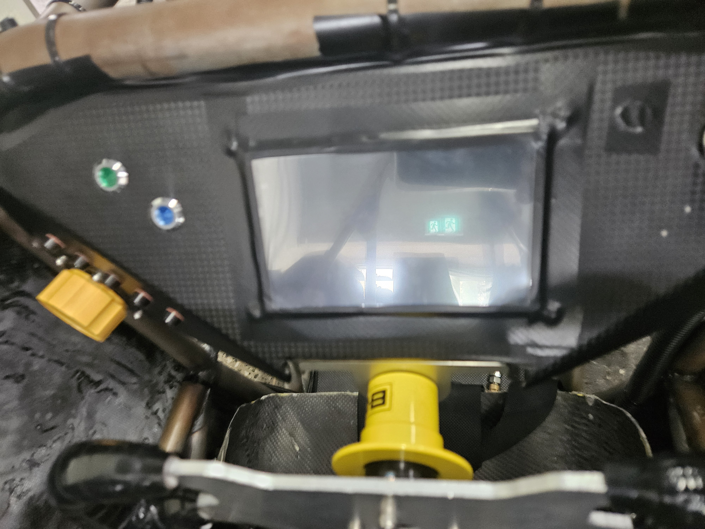
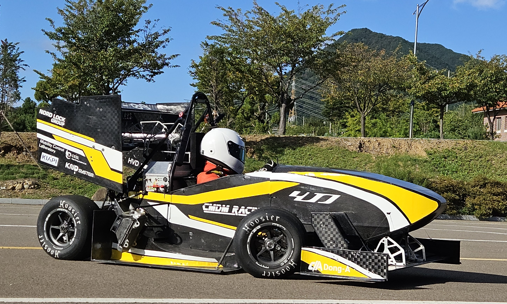
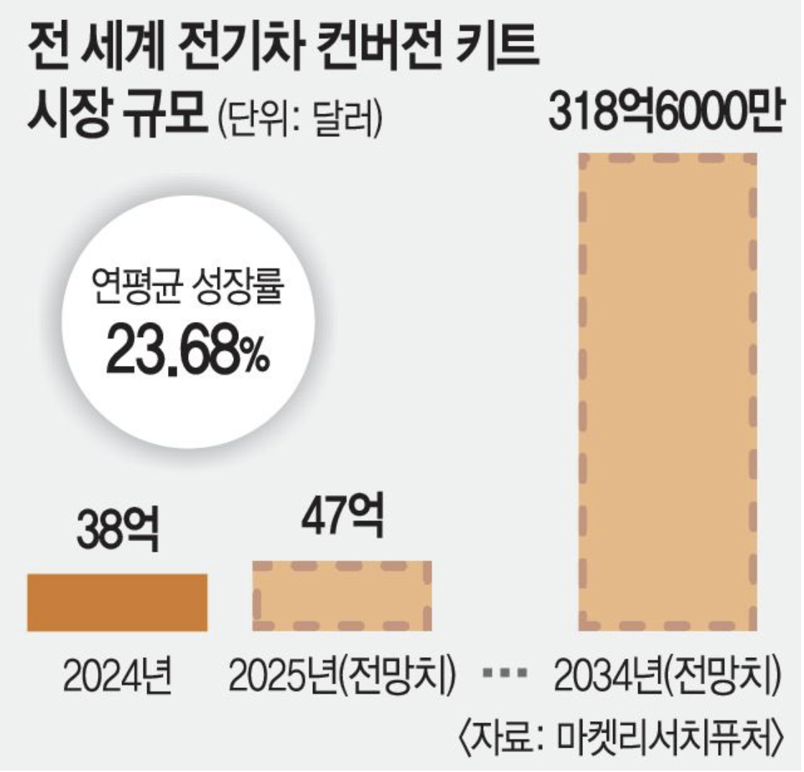
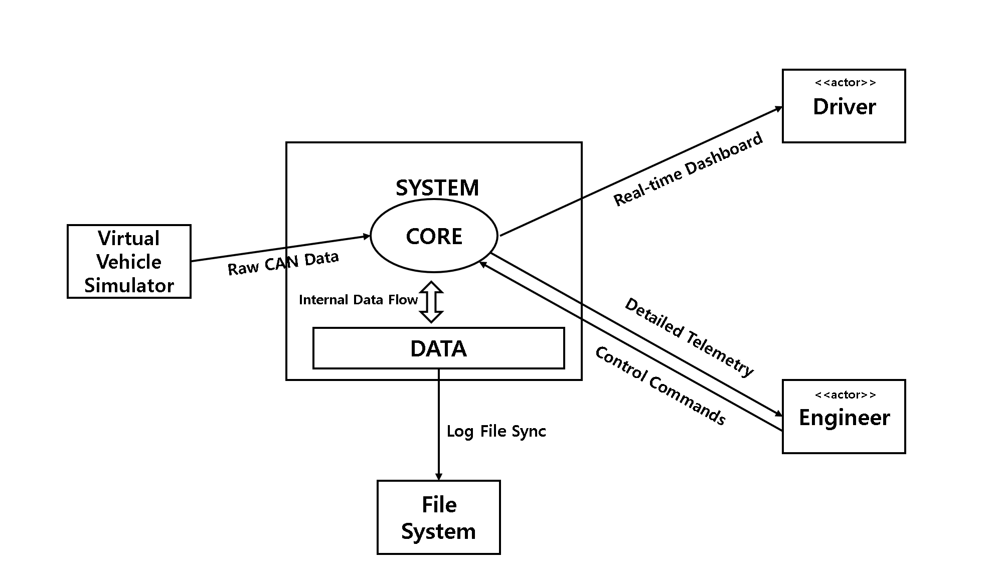

# 1. Conceptualization

## V-MAP

(22411985, 정수영, sy.jeong100@gmail.com)

[ Revision history ]

| **Revision date** | **Version #** | **Description** | **Author** |
| --- | --- | --- | --- |
| 20/03/2026 | 0.0.1 | 초안 작성 | 정수영 |
| 26/03/2026 | 0.0.2 | uses case 추가 | 정수영 |
|  |  |  |  |
|  |  |  |  |
|  |  |  |  |
|  |  |  |  |

# = Contents =

### 1. Business purpose ..................................................................................
### 2. System context diagram .......................................................................
### 3. Use case list .........................................................................................
### 4. Concept of operation ............................................................................
### 5. Problem statement ................................................................................
### 6. Glossary .................................................................................................
### 7. References .................................................................................................

  

# 1. Business purpose

## 1-1. Background

본 프로젝트는 자작 자동차 대회 현장에서 발생하는 정보 전달의 폐쇄성과 실시간 모니터링의 한계를 극복하기 위해 기획되었습니다. 자작차 동아리(FSK) 활동 중, 차량의 핵심 데이터가 운전석의 소형 디스플레이에만 표시되고 각 센서의 값을 무선으로 띄우지 못해 직접 케이블을 연결해야 모터의 성능을 확인하는 등 피트스탑의 엔지니어들이 차량 상태를 즉각 파악하기 어렵다는 문제를 발견했습니다. 특히 최근 자동차 산업이 하드웨어 중심에서 소프트웨어 중심 자동차(SDV)로 급격히 전환됨에 따라, 물리적 버튼을 최소화하고 모바일 기기나 웹을 통해 차량을 제어·관리하는 기술의 중요성이 대두되고 있습니다.

<그림1 차량 대시보드>
    
<그림2 운전자가 차량내 버튼으로 수동조작>

## 1-2. Target Market

<그림3 전기차 개조 시장 성장률>

대학생 자작 자동차 팀 (KSAE, FSAE 등): 매년 국내외 대회에 참가하는 약 100개 이상의 대학 팀들이 주요 타겟입니다. 고가의 상용 장비를 구매하기 어려운 학생들에게 최적의 솔루션을 제공합니다.

소규모 EV 스타트업 및 개조 시장: 전기차 개조(Conversion) 시장은 매년 평균 20% 이상의 성장률을 보이고 있으며, 이들에게는 합리적인 가격의 범용 텔레메트리 시스템이 필수적입니다.

스마트 모빌리티 연구소: 실시간 데이터 분석이 필요한 연구 기관이나 교육 기관을 포함합니다.

## 1-3. Goal

데이터 접근성 혁신: 모터 RPM, 배터리 온도, 6축 자이로 센서 데이터 등 15종 이상의 차량 핵심 데이터를 웹을 통해 실시간 시각화합니다.

실시간성 확보: 웹소켓(WebSocket) 기술을 활용하여 데이터 전송 지연 시간을 0.5초(500ms) 이내로 유지하여 실제 주행 상황과의 괴리를 최소화합니다.

안전 및 분석 자동화: 임계값 초과 시 즉각적인 경고 알림을 발송하고, 모든 주행 데이터를 로그 파일로 기록하여 차량 성능 최적화를 위한 기초 자료를 생성합니다.

  

# 2. System context diagram

- 시스템 (System): 차량 데이터를 처리하고 시각화하며 사용자의 제어 명령을 실행하는 핵심 프로그램입니다.
- 사용자 (Users): 시스템과 상호작용하는 외부 주체로, 본 시스템에서는 드라이버(Driver)와 엔지니어(Engineer) 두 부류로 정의됩니다.
- 드라이버 (Driver): 주행 중인 차량의 상태를 실시간 대시보드로 확인하는 사용자 입니다.
- 엔지니어 (Engineer): 차량의 정밀 데이터를 분석하고 원격 제어 명령을 하달하는 관리자급 사용자입니다.
- 가상 차량 시뮬레이터 (Virtual Vehicle Simulator): 시스템 경계 밖에서 실제 차량의 CAN 데이터를 모방하여 시스템에 공급하는 데이터 소스입니다.
- 파일 시스템 (File System): 주행 로그를 영구 저장하거나 불러오는 외부 저장 매체입니다.
- 관계 (Relationships): 시스템과 액터 간에 주고받는 Dashboard, Telemetry, Commands 등의 데이터 흐름은 각 사용자의 역할과 시스템 간의 유기적인 동작 관계를 나타냅니다.

  

# 3. Use case list

1) **시스템 로그인 (Login)**

| Actor | Driver, Engineer |
| --- | --- |
| Description | 사용자가 시스템 권한을 얻기 위해 아이디와 비밀번호를 입력하여 접속한다. |

2) **실시간 대시보드 조회 (View Real-time Dashboard)**

| Actor | Driver |
| --- | --- |
| Description | 주행 중인 차량의 속도, RPM, 배터리 잔량 등 필수 정보를 실시간으로 확인한다. |

3) **원시 데이터 생성 및 전송 (Generate Raw Data)**

| Actor | 가상 차량 시뮬레이터 |
| --- | --- |
| Description | 실제 차량의 하드웨어 대신 가상의 주행 패킷(CAN Data)을 생성하여 시스템에 공급한다. |

4) 상세 텔레메트리 모니터링 (Monitor Detailed Telemetry)

| Actor | Engineer |
| --- | --- |
| Description | 모터 온도, 인버터 전류, 전압 등 차량의 정밀한 센서 데이터를 실시간으로 관제한다. |

5) 차량 원격 제어 명령 전송 (Send Control Commands)

| Actor | Engineer |
| --- | --- |
| Description | 앱을 통해 차량의 라이트 조절이나 주행 모드 변경 등 원격 제어 신호를 하달한다. |

6) 주행 데이터 로깅 저장 (Log Drive Data)

| Actor | Engineer |
| --- | --- |
| Description | 실시간으로 수집되는 차량 데이터를 파일 시스템에 CSV 또는 로그 형태로 영구 저장한다. |

7) 과거 주행 데이터 재생 (Playback Previous Logs)

| Actor | Engineer |
| --- | --- |
| Description | 파일 시스템에 저장된 이전 주행 기록을 불러와 특정 구간의 차량 상태를 재현한다. |

8) 임계값 초과 경고 알림 수신 (Receive Threshold Alerts)

| Actor | Driver, Engineer |
| --- | --- |
| Description | 배터리 온도나 모터 온도가 설정된 위험 수치를 넘을 경우 즉각적인 경고 팝업을 수신한다. |

9) 배터리 셀 상태 정밀 분석 (Analyze Battery Cell Status)

| Actor | Engineer |
| --- | --- |
| Description | 배터리 팩 내부의 각 셀 전압 불균형 상태를 확인하여 배터리 안전성을 점검한다. |

10) 전비 및 주행 효율 계산 (Calculate Energy Efficiency)

| Actor | Engineer |
| --- | --- |
| Description | 현재 소비 전력 대비 주행 가능 거리와 에너지 효율(전비)을 실시간으로 산출한다. |

11) 경고 알림 임계값 설정 (Configure Alert Thresholds)

| Actor | Engineer |
| --- | --- |
| Description | 차량의 안전 운행을 위해 경고가 발생하는 온도나 압력의 기준치를 직접 설정한다. |

12) 네트워크 지연시간 모니터링 (Monitor Network Latency)

| Actor | System |
| --- | --- |
| Description | 시뮬레이터와 서버, 클라이언트 간의 데이터 전송 지연 시간을 실시간으로 체크하여 데이터 신뢰성을 확보한다. |

13) 주행 데이터 리포트 출력 (Export Drive Report)

| Actor | Engineer |
| --- | --- |
| Description | 저장된 로그 데이터를 바탕으로 주행 요약 리포트 및 그래프를 외부 파일로 내보낸다. |

  

# 4. Concept of operation

1) 시스템 로그인 (Login)

| Purpose | 앱을 사용하기 위해 등록된 사용자인지 확인 |
| --- | --- |
| Approach | 사용자로부터 ID(학번)와 패스워드를 입력받아 내부 데이터베이스의 회원 정보와 대조하여 인증을 수행한다. |
| Dynamics | 앱을 최초로 실행하거나 로그아웃 후 다시 접속하고자 할 때 발생한다. |
| Goals | 비인가자의 차량 데이터 접근 및 제어 명령 발송을 차단하여 보안을 확보한다. |

2) 실시간 대시보드 조회 (View Real-time Dashboard)

| Purpose | 주행 중인 드라이버에게 필수 정보를 실시간으로 시각화하여 전달 |
| --- | --- |
| Approach | 서버로부터 수신되는 가공된 데이터를 파싱하여 속도계, 배터리 게이지 등 UI 컴포넌트에 즉시 업데이트한다. |
| Dynamics | 드라이버가 주행 중 실시간 대시보드 화면을 유지하고 있는 동안 지속된다. |
| Goals | 드라이버가 차량 상태를 직관적으로 파악하여 안전하고 효율적인 운행을 돕는다. |

3) 원시 데이터 생성 및 전송 (Generate Raw Data)

| Purpose | 실제 차량 하드웨어가 없는 환경에서 개발 및 테스트를 위한 가상 데이터 공급 |
| --- | --- |
| Approach | 시뮬레이터 클래스 내에서 랜덤 함수 또는 정의된 시나리오에 따라 CAN 패킷 형태의 원시 데이터를 생성하여 서버로 전송한다. |
| Dynamics | 시스템 운영이 시작되고 데이터 수집 기능이 활성화될 때 자동으로 가동된다. |
| Goals | 물리적 하드웨어 제약 없이 시스템의 전체 로직과 UI 동작을 완벽히 검증한다. |

4) 상세 텔레메트리 모니터링 (Monitor Detailed Telemetry)

| Purpose | 엔지니어가 차량의 정밀 상태를 실시간 관제하여 기술적 의사결정 지원 |
| --- | --- |
| Approach | 수집된 모든 센서 데이터를 실시간 그래프 및 수치 테이블 형태로 상세하게 출력하여 분석 도구를 제공한다. |
| Dynamics | 엔지니어가 피트(Pit)에서 정밀 분석 모드 화면으로 진입했을 때 발생한다. |
| Goals | 차량의 이상 징후를 조기에 발견하고 성능 최적화를 위한 근거 자료를 확보한다. |

5) 차량 원격 제어 명령 전송 (Send Control Commands)

| Purpose | 소프트웨어를 통해 원격지에서 차량의 물리적 기능을 조작 |
| --- | --- |
| Approach | 엔지니어가 앱의 제어 버튼을 클릭하면 해당 명령을 패킷화하여 가상 차량 시스템으로 전송 및 적용한다. |
| Dynamics | 엔지니어가 차량의 라이트 조절이나 특정 시스템 설정을 변경하고자 할 때 발생한다. |
| Goals | 물리적 버튼 의존도를 낮추고 소프트웨어 중심(SDV)의 유연한 차량 제어를 실현한다. |

6) 주행 데이터 로깅 저장 (Log Drive Data)

| Purpose | 주행 중 수집된 원시 데이터를 영구 저장하여 사후 정밀 분석에 활용함. |
| --- | --- |
| Approach | 수신되는 실시간 센서 데이터를 CSV 또는 로그 파일 포맷으로 변환하여 로컬 파일 시스템에 실시간으로 기록한다. |
| Dynamics | 주행 세션이 시작되고 데이터 수집 기능이 활성화된 상태에서 시스템 종료 시까지 지속적으로 수행된다. |
| Goals | 주행 후 데이터 기반의 피드백을 가능하게 하여 차량 성능 개선을 위한 원시 데이터베이스를 구축한다. |

7) 과거 주행 데이터 재생 (Playback Previous Logs)

| Purpose | 저장된 로그 파일을 다시 불러와 과거 특정 시점의 차량 주행 상황을 재현함. |
| --- | --- |
| Approach | 파일 시스템에서 저장된 로그 파일을 선택하여 로드한 후, 대시보드와 텔레메트리 화면에 시계열 데이터로 재생한다. |
| Dynamics | 엔지니어가 주행 테스트 종료 후 특정 구간의 성능을 분석하기 위해 파일을 불러올 때 발생한다. |
| Goals | 사고 발생 원인이나 성능 저하 구간을 정밀하게 복기하여 기술적 결함을 파악한다. |

8) 임계값 초과 경고 알림 수신 (Receive Threshold Alerts)

| Purpose | 차량 시스템에 이상 징후 발생 시 드라이버와 엔지니어에게 즉각 통보하여 사고를 예방함. |
| --- | --- |
| Approach | 수집된 데이터가 설정된 안전 임계값(온도, 전압 등)을 벗어날 경우 UI 상에 시각적 경고 팝업과 음성 알림을 발생시킨다. |
| Dynamics | 실시간 모니터링 중 특정 센서 수치가 정의된 위험 범위에 도달할 때 시스템이 자동으로 감지하여 실행한다. |
| Goals | 주요 하드웨어 부품의 손상을 방지하고 주행 중인 드라이버의 생명과 안전을 확보한다. |

9) 배터리 셀 상태 정밀 분석 (Analyze Battery Cell Status)

| Purpose | 배터리 팩 내부의 개별 셀 밸런싱 상태를 확인하여 전력 계통의 안전성을 점검함. |
| --- | --- |
| Approach | BMS(Battery Management System)로부터 전달받은 각 셀 전압 데이터를 막대그래프 형태로 시각화하여 셀 간 편차를 분석한다. |
| Dynamics | 엔지니어가 차량의 배터리 컨디션을 점검하거나 충전 전략을 수립하고자 할 때 수행한다. |
| Goals | 배터리 수명을 극대화하고 과충전 및 과방전으로 인한 화재 위험을 사전에 차단한다. |

10) 전비 및 주행 효율 계산 (Calculate Energy Efficiency)

| Purpose | 실시간 에너지 소비 패턴 분석을 통해 최적의 주행 가능 거리를 산출함. |
| --- | --- |
| Approach | 소비 전력량과 주행 거리를 실시간으로 연산하여 에너지 효율(km/kWh)을 산출하고 주행 가능 거리를 예측한다. |
| Dynamics | 주행 중 실시간 데이터가 유입되는 동안 백엔드 엔진에서 연산 로직이 지속적으로 가동된다. |
| Goals | 효율적인 주행 전략 수립을 지원하여 대회의 효율성 부문 성적을 향상시킨다. |

11) 경고 알림 임계값 설정 (Configure Alert Thresholds)

| Purpose | 주행 환경이나 차량 하드웨어 셋업 변경에 맞춰 경고 기준치를 유연하게 조정함. |
| --- | --- |
| Approach | 시스템 설정 메뉴에서 온도, 압력 등 각 센서 항목별 위험 수치(Threshold)를 입력하여 시스템 로직에 즉시 반영한다. |
| Dynamics | 주행 시작 전 또는 엔지니어가 특정 테스트 시나리오를 변경하고자 할 때 발생한다. |
| Goals | 환경 변화에 따른 오경보를 최소화하고 상황에 맞는 정확한 위험 감지가 가능하도록 한다. |

12) 네트워크 지연시간 모니터링 (Monitor Network Latency)

| Purpose | 데이터 통신 지연을 상시 체크하여 원격 제어 명령의 신뢰성과 데이터 실시간성을 확보함. |
| --- | --- |
| Approach | 서버와 클라이언트 간의 패킷 전송 주기를 측정하여 지연시간(Latency, ms)을 모니터링 화면 하단에 표시한다. |
| Dynamics | 시스템이 네트워크에 연결되어 시뮬레이터와 통신이 이루어지는 전 과정에서 백그라운드로 수행된다. |
| Goals | 데이터 지연으로 인한 오판을 방지하고 시스템 전반의 통신 신뢰도를 검증한다. |

13) 주행 데이터 리포트 출력 (Export Drive Report)

| Purpose | 주행 분석 결과를 문서화하여 팀원 간의 원활한 기술 공유와 기술 자산화를 도모함. |
| --- | --- |
| Approach | 주행 로그의 통계적 요약 수치와 주요 그래프를 포함한 PDF 또는 Excel 형태의 최종 보고서를 생성하여 내보낸다. |
| Dynamics | 모든 주행 테스트 세션이 종료된 후 엔지니어가 분석 결과 공유를 위해 출력 명령을 실행할 때 발생한다. |
| Goals | 객관적인 데이터 기반의 차량 개선 방향을 수립하고 프로젝트의 기술적 자산을 축적한다. |

  

# 5. Problem statement

**5.1. Overview**

V-Map(Vehicle Monitoring & Analysis Platform)은 전기 자동차의 핵심 데이터를 실시간으로 모니터링하고 원격 제어하는 것을 주 목적으로 한다. 하지만 실제 차량의 CAN 통신망에 직접 접근하기에는 장비 및 장소의 제약이 크며, 하드웨어 계층의 복잡성으로 인해 개발 단계에서 예기치 못한 오류가 발생할 가능성이 높다. 따라서 본 프로젝트는 실제 차량 대신 '가상 차량 시뮬레이터'를 구축하여 데이터를 공급받으며, 실제 환경과 유사한 실시간 성능을 확보하는 것을 핵심 과제로 삼는다.

**5.2. Problem definition (Technical Difficulties)**

**5.2.1. Problem #1: 하드웨어 접근성 및 데이터 시뮬레이션**
실제 전기차의 ECU와 통신하기 위해서는 고가의 하드웨어 인터페이스와 실제 차량이 필요하다. 이러한 물리적 제약을 극복하기 위해 본 프로젝트에서는 실제 CAN-bus 통신 패킷을 모사하는 가상 시뮬레이터 클래스를 생성한다. 시나리오 기반의 데이터 생성을 통해 하드웨어 없이도 시스템 로직을 검증할 수 있도록 설계한다.

**5.2.2. Problem #2: 실시간 데이터 동기화 및 처리**
자동차 데이터는 수 밀리초(ms) 단위로 변화하므로, 시스템은 지연 시간(Latency)을 최소화해야 한다. 시뮬레이터에서 발생하는 방대한 양의 데이터를 백엔드 서버에서 처리하고, 이를 다시 웹/앱 UI에 반영하는 과정에서 병목 현상이 발생할 수 있다. 이를 해결하기 위해 멀티 쓰레딩 기술을 도입하여 데이터 수신과 시각화 과정을 분리 처리한다.

**5.2.3. Problem #3: 통신 프로토콜 설계 및 무결성 확보**
가상 시뮬레이터와 시스템 엔진(Core) 간의 데이터 전송 시, 데이터의 시작과 끝을 명확히 구분하고 명령어를 정확히 전달하기 위한 프로토콜 정의가 필수적이다. STX, Command, Data, ETX 구조를 갖춘 사용자 정의 프로토콜을 설계하여 데이터 전송 중 발생할 수 있는 손실이나 왜곡을 방지한다.

**5.3. Non-Functional Requirements (NFRs)**

**실시간성 (Performance)**: 가상 시뮬레이터에서 데이터가 발생한 후 사용자 화면에 표시되기까지의 지연 시간을 **0.5초 이내**로 유지해야 한다.

**안전성 및 신뢰성 (Reliability)**: 수집된 센서 데이터는 실제 발생 수치와 일치해야 하며, 임계값 초과 시 경고 알림의 성공률은 100%를 유지해야 한다.

**보안성 (Security)**: 비인가자의 원격 제어 명령 발송을 방지하기 위해 드라이버와 엔지니어의 **권한 관리 및 로그인 시스템**을 구축해야 한다.

**사용성 (Usability)**: 드라이버는 주행 중 한눈에 상태를 파악할 수 있는 **직관적인 UI**를 제공받아야 하며, 엔지니어는 복잡한 데이터를 분석할 수 있는 **정밀한 그래프 도구**를 이용할 수 있어야 한다.

  

# 6. Glossary

| **V-Map** | 차량의 실시간 데이터를 모니터링하고 분석 및 제어하는 통합 플랫폼. |
| --- | --- |
| **드라이버 (Driver)** | 실시간 대시보드를 통해 차량 주행 상태를 확인하는 시스템 사용자. |
| **엔지니어 (Engineer)** | 상세 데이터를 관제하고 원격 제어 명령을 하달하는 기술 전문가. |
| **가상 차량 시뮬레이터** | 하드웨어 제약 없이 차량 통신(CAN) 데이터를 생성하는 가상 환경 엔진. |
| **Core** | 데이터 파싱, 로직 처리 및 외부 통신을 중계하는 시스템의 핵심 연산 계층. |
| **Data** | 실시간으로 유입되는 정보를 일시적으로 유지하고 관리하는 내부 저장 계층. |
| **Raw CAN Data** | 차량 내부 통신망에서 발생하는 가공되지 않은 16진수 형태의 원시 데이터. |
| **텔레메트리 (Telemetry)** | 원격지에서 차량의 센서 데이터 및 상태 정보를 실시간으로 수집하는 기술. |
| **제어 명령 (Commands)** | 소프트웨어를 통해 차량의 물리적 장치(라이트, 주행 모드 등)를 조작하는 신호. |
| **SDV** | 하드웨어가 아닌 소프트웨어에 의해 기능이 정의되고 제어되는 차세대 자동차 모델. |
| **프로토콜 (Protocol)** | 시뮬레이터와 시스템 간의 원활한 데이터 송수신을 위해 정의된 규약 체계. |
| **로깅 (Logging)** | 사후 분석을 위해 주행 데이터를 파일 시스템에 영구적으로 기록하는 행위. |
| **쓰레드 (Thread)** | 데이터 수신과 화면 갱신을 동시에 처리하기 위해 프로세스 내에서 실행되는 흐름 단위. |
| **임계값 (Threshold)** | 경고 알림을 발생시키기 위해 설정된 안전 수치의 기준점. |

  

# 7. References

<그림 3> - [https://www.kmib.co.kr/article/view.asp?arcid=1758438790](https://www.kmib.co.kr/article/view.asp?arcid=1758438790)