# 3. Design

## V-MAP

(22411985, 정수영, sy.jeong100@gmail.com, <https://github.com/suyeong-jeong/V-MAP>)

[ Revision history ]

| **Revision date** | **Version #** | **Description** | **Author** |
| :--- | :--- | :--- | :--- |
| 20/03/2026 | 0.0.1 | 초안 작성 | 정수영 |
| 26/03/2026 | 0.0.2 | uses case 추가 | 정수영 |
| 08/05/2026 | 0.0.3 | Analysis 작성 | 정수영 |
| 05/06/2026 | 0.0.4 | Design 작성 | 정수영 |
| 10/06/2026 | 0.0.5 | Implementation 작성| 정수영 |
| 10/06/2026 | 0.0.6 | 구현 환경 변경 반영 수정| 정수영 |

# = Contents =

### 1. Introduction ..................................................................................
### 2. Class diagram ..............................................................................
### 3. Sequence diagram .....................................................................
### 4. State machine diagram ............................................................
### 5. Implementation requirements ...............................................
### 6. Glossary .........................................................................................
### 7. References ....................................................................................

  
## 1. Introduction

현재 자동차 산업은 단순한 이동 수단을 넘어 소프트웨어 중심의 차량(SDV)으로 진화하고 있으며, 차량 내부 통신 데이터의 정밀한 분석과 실시간 모니터링은 차기 차량 설계 및 성능 최적화에 필수적인 요소가 되었다. 특히 주행 중 발생하는 다양한 CAN(Controller Area Network) 데이터의 이상치를 빠르게 감지하고 대응하는 것은 운전자의 안전과 직결된다.

본 프로젝트 **V-Map**은 차량의 실시간 텔레메트리 데이터를 수집, 시각화하고 이상치 감지 및 분석 기능을 제공하는 **통합 주행 데이터 관리 시스템**이다. 본 시스템은 크게 데이터를 생성하고 전송하는 Server와 이를 수신하여 실시간으로 모니터링하고 제어하는 Client로 구성된다.

본 문서는 설계 단계의 산출물로서, 시스템의 정적인 구조를 정의하는 Class Diagram과 시스템의 동적인 동작 흐름을 시각화한 Sequence Diagram, 그리고 서버와 클라이언트의 동작 상태 전이를 정의한 State Machine Diagram을 포함한다. 본 시스템은 가상 환경(SITL, Software-in-the-Loop)을 통해 실제 하드웨어 없이도 소프트웨어 로직과 통신 프로토콜을 완벽히 검증하도록 설계되었으며, 안정적인 데이터 처리를 위해 Python 기반 시뮬레이션 엔진과 웹 표준 기술 기반의 UI를 기반으로 구축되었다.

본 설계 문서는 Analysis 단계에서 도출된 요구사항을 바탕으로, 효율적이고 확장 가능한 SDV 소프트웨어 아키텍처를 구현하기 위한 기술적 청사진을 제시하는 데 목적이 있다.

  
## 2. Class diagram

본 V-Map 시스템은 크게 사용자 화면 및 데이터 처리를 담당하는 **Client(App) 시스템**과 가상 차량 데이터를 생성하고 전송하는 **Server(Simulator) 시스템**으로 나누어 설계되었다.

### 2.1. Client / App System

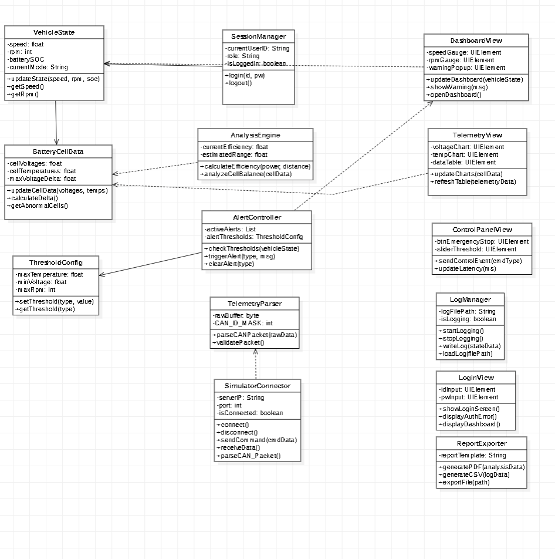
*<그림 1> Client Class Diagram*

**1) VehicleState**
| 분류 | 내용 및 설명 |
| :--- | :--- |
| **Attributes** | `- speed: float` : 차량의 현재 속도 데이터 `- rpm: int` : 모터/엔진의 분당 회전수 `- batterySOC: float` : 배터리 충전 상태(State of Charge) 비율 `- currentMode: String` : 현재 주행 모드 (예: Normal, Eco, Sport) |
| **Methods** | `+ updateState(speed, rpm, soc)` : 수신된 데이터로 차량 상태 갱신 `+ getSpeed()` : 현재 속도 값 반환 `+ getRpm()` : 현재 RPM 값 반환 |

**2) BatteryCellData**
| 분류 | 내용 및 설명 |
| :--- | :--- |
| **Attributes** | `- cellVoltages: float` : 배터리 셀별 전압 수치 `- cellTemperatures: float` : 배터리 셀별 온도 수치 `- maxVoltageDelta: float` : 셀 간 최대 전압 편차 (밸런싱 분석용) |
| **Methods** | `+ updateCellData(voltages, temps)` : 셀 전압/온도 데이터 갱신 `+ calculateDelta()` : 셀 간의 편차 계산 로직 `+ getAbnormalCells()` : 이상 수치를 보이는 배터리 셀 탐지 및 반환 |

**3) AnalysisEngine**
| 분류 | 내용 및 설명 |
| :--- | :--- |
| **Attributes** | `- currentEfficiency: float` : 현재 전비/효율 계산 값 `- estimatedRange: float` : 잔여 배터리 기반 주행 가능 거리 |
| **Methods** | `+ calculateEfficiency(power, distance)` : 전력 소모량 대비 주행 거리 효율 계산 `+ analyzeCellBalance(cellData)` : 배터리 셀 밸런싱 상태 분석 |

**4) ThresholdConfig**
| 분류 | 내용 및 설명 |
| :--- | :--- |
| **Attributes** | `- maxTemperature: float` : 경고를 발생시킬 최대 온도 임계값 `- minVoltage: float` : 경고를 발생시킬 최저 전압 임계값 `- maxRpm: int` : 경고를 발생시킬 최대 RPM 임계값 |
| **Methods** | `+ setThreshold(type, value)` : 특정 데이터 타입의 임계값 설정 `+ getThreshold(type)` : 설정된 임계값 반환 |

**5) AlertController**
| 분류 | 내용 및 설명 |
| :--- | :--- |
| **Attributes** | `- activeAlerts: List` : 현재 활성화된 위험/경고 리스트 `- alertThresholds: ThresholdConfig` : 경고 판별을 위한 임계값 설정 객체 참조 |
| **Methods** | `+ checkThresholds(vehicleState)` : 차량 데이터가 임계값을 초과했는지 검사 `+ triggerAlert(type, msg)` : 조건 충족 시 화면에 경고 이벤트 발생 `+ clearAlert(type)` : 상황 해제 시 경고 상태 초기화 |

**6) SessionManager**
| 분류 | 내용 및 설명 |
| :--- | :--- |
| **Attributes** | `- currentUserID: String` : 현재 접속 중인 사용자 ID `- role: String` : 사용자 권한 (관리자/일반) `- isLoggedIn: boolean` : 현재 로그인 유지 여부 |
| **Methods** | `+ login(id, pw)` : 사용자 로그인 검증 및 세션 생성 `+ logout()` : 현재 세션 파기 및 로그아웃 처리 |

**7) TelemetryParser & SimulatorConnector**
| 분류 | 내용 및 설명 |
| :--- | :--- |
| **Attributes** | `- rawBuffer: byte` : 수신된 가공 전 Raw 데이터 버퍼 `- CAN_ID_MASK: int` : CAN 통신 패킷 ID 식별 마스크 `- serverIP: String` : 연결할 서버 IP 주소 `- port: int` : 통신 포트 번호 `- isConnected: boolean` : 서버 연결 상태 |
| **Methods** | `+ parseCANPacket(rawData)` : Raw 데이터를 시스템에 맞게 파싱 `+ validatePacket()` : 수신된 패킷의 무결성 검증 `+ connect() / disconnect()` : 서버 연결 및 해제 `+ sendCommand(cmdData)` : 제어 명령을 서버로 전송 |

**8) View & UI Classes (DashboardView, TelemetryView, ControlPanelView, LoginView)**
| 분류 | 내용 및 설명 |
| :--- | :--- |
| **Attributes** | `- speedGauge, rpmGauge, warningPopup, idInput` 등 : 화면 구성을 위한 각종 UI 컴포넌트 요소들 |
| **Methods** | `+ updateDashboard(), updateCharts(), showWarning()` 등 : 수신된 데이터에 맞춰 UI를 갱신하거나 화면을 전환하는 프론트엔드 제어 함수들 |

**9) LogManager & ReportExporter**
| 분류 | 내용 및 설명 |
| :--- | :--- |
| **Attributes** | `- logFilePath: String` : 데이터 로그 파일이 저장될 경로 `- isLogging: boolean` : 현재 로깅 진행 여부 `- reportTemplate: String` : 출력할 PDF 보고서의 기본 템플릿 양식 |
| **Methods** | `+ startLogging() / stopLogging()` : 데이터 기록 시작 및 중지 `+ writeLog(stateData)` : 실시간 상태 데이터를 파일에 기록 `+ generatePDF(analysisData)` : 분석 데이터를 바탕으로 PDF 보고서 생성 및 추출 |

---

### 2.2. Server / Simulator System

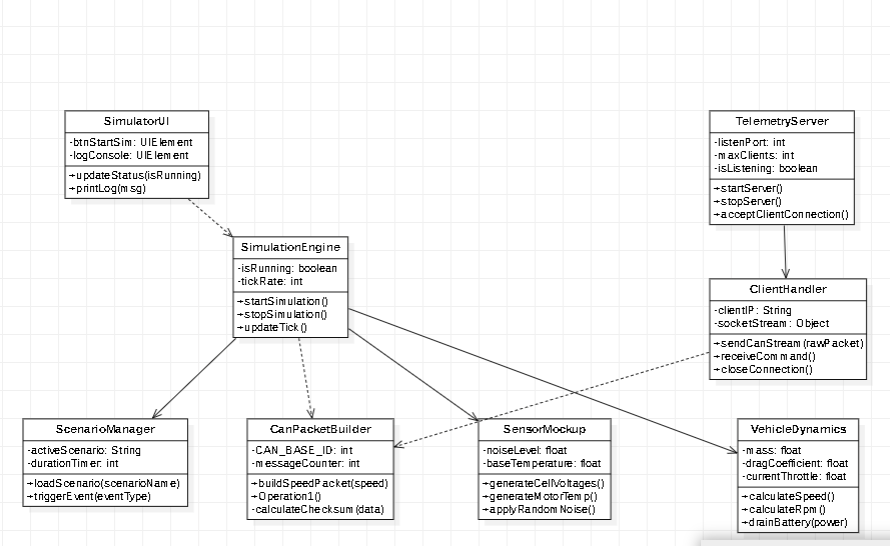
*<그림 2> Server Class Diagram*

**1) TelemetryServer & ClientHandler**
| 분류 | 내용 및 설명 |
| :--- | :--- |
| **Attributes** | `- listenPort: int` : 클라이언트 접속을 대기할 포트 번호 `- maxClients: int` : 최대 수용 가능 클라이언트 수 `- isListening: boolean` : 현재 포트 개방 및 대기 상태 `- clientIP: String` : 접속한 클라이언트의 IP 주소 `- socketStream: Object` : 클라이언트와의 데이터 송수신 소켓 객체 |
| **Methods** | `+ startServer() / stopServer()` : 서버 가동 및 종료 로직 `+ acceptClientConnection()` : 클라이언트의 접속 요청 수락 `+ sendCanStream(rawPacket)` : 생성된 CAN 데이터를 클라이언트로 스트리밍 `+ receiveCommand()` : 클라이언트(앱)로부터 긴급 제어 등의 명령 수신 |

**2) SimulationEngine & ScenarioManager**
| 분류 | 내용 및 설명 |
| :--- | :--- |
| **Attributes** | `- isRunning: boolean` : 시뮬레이션 엔진 구동 상태 `- tickRate: int` : 시뮬레이션 데이터 갱신 주기 (Hz) `- activeScenario: String` : 현재 로드된 주행 시나리오 (예: 고속도로, 시내) `- durationTimer: int` : 시나리오 진행 경과 시간 |
| **Methods** | `+ startSimulation() / stopSimulation()` : 엔진 시작 및 중지 `+ updateTick()` : 틱레이트에 맞춰 차량 동역학 및 센서 상태 갱신 `+ loadScenario(scenarioName)` : 지정된 환경 시나리오 파일 로드 |

**3) VehicleDynamics**
| 분류 | 내용 및 설명 |
| :--- | :--- |
| **Attributes** | `- mass: float` : 가상 차량의 질량 `- dragCoefficient: float` : 공기 저항 계수 `- currentThrottle: float` : 현재 스로틀(가속 페달) 전개량 |
| **Methods** | `+ calculateSpeed()` : 물리 법칙에 따른 현재 차량 속도 연산 `+ calculateRpm()` : 스로틀 및 속도 기반 RPM 연산 `+ drainBattery(power)` : 소모 전력에 따른 배터리 잔량 감소 시뮬레이션 |

**4) SensorMockup & CanPacketBuilder**
| 분류 | 내용 및 설명 |
| :--- | :--- |
| **Attributes** | `- noiseLevel: float` : 센서 데이터에 섞일 가상 노이즈 수준 `- baseTemperature: float` : 기본 환경 온도 `- CAN_BASE_ID: int` : 생성할 CAN 패킷의 기본 ID `- messageCounter: int` : 전송된 메시지 시퀀스 카운터 |
| **Methods** | `+ generateCellVoltages() / generateMotorTemp()` : 동역학 데이터를 바탕으로 가상의 배터리 및 모터 센서 데이터 생성 `+ applyRandomNoise()` : 실제 센서처럼 데이터에 오차(Noise) 부여 `+ buildSpeedPacket(speed)` : 생성된 데이터를 CAN 프로토콜 규격에 맞게 패킷화 `+ calculateChecksum(data)` : 데이터 무결성 검증을 위한 체크섬 연산 |

  
## 3. Sequence diagram

### 3.1. User Login and Authentication (UC01)

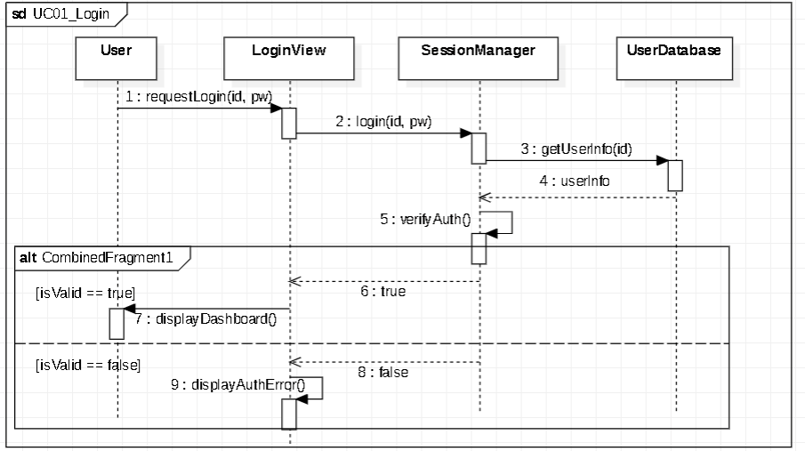
*<그림 3> User Login Sequence diagram*

위 그림은 사용자가 시스템에 접속하기 위해 로그인을 수행하는 과정이다. 사용자가 아이디와 비밀번호를 입력하고 로그인을 시도하면, `LoginView`에서 `SessionManager`로 로그인을 요청한다. 이후 내부적으로 세션을 검증하며, 인증 성공 시(alt 분기) `DashboardView`로 화면이 전환되고, 실패 시 화면에 에러 메시지를 출력한다.

### 3.2. Real-time CAN Data Streaming (UC02)

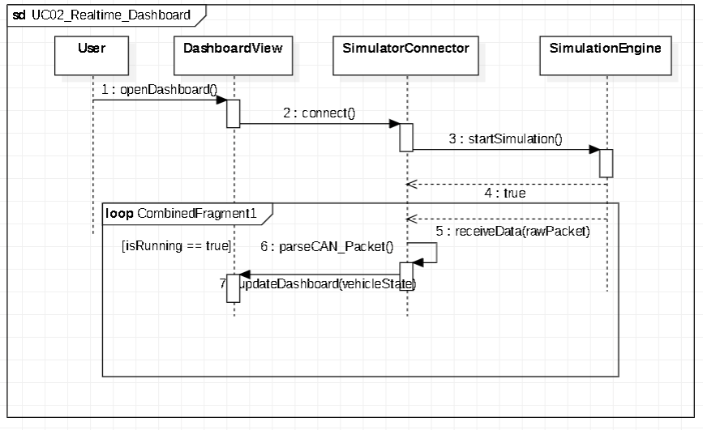
*<그림 4> Real-time CAN Data Streaming Sequence diagram*

위 그림은 차량의 실시간 CAN 데이터를 수신하고 대시보드를 갱신하는 과정이다. `SimulatorConnector`를 통해 서버로부터 고속으로 들어오는 CAN 데이터가 `TelemetryParser`로 전달된다. 파서에서 데이터를 시스템 규격에 맞게 파싱(Parsing)한 뒤, `DashboardView`로 전달하여 화면의 속도계 및 RPM 게이지 등을 실시간으로 갱신하는 무한 반복(Loop) 통신 과정을 보여준다.

### 3.3. Abnormal Alert (UC03)

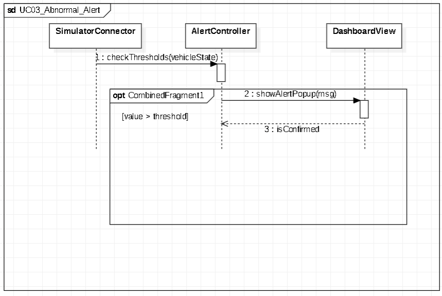
*<그림 5> Abnormal Alert Sequence diagram*

위 그림은 주행 중 차량 데이터의 이상치를 감지하고 즉각적인 경고를 발생하는 제어 과정이다. 수신된 텔레메트리 데이터가 `AlertController`로 전달되며, 미리 설정된 임계값(Threshold)을 초과하는지 지속해서 검사한다. 데이터가 기준치를 초과하는 위험 조건에 부합할 경우(opt 분기), 즉시 `DashboardView`에 위험 경고 팝업을 띄워 사용자에게 알린다.

### 3.4. Data Logging and Export (UC04)

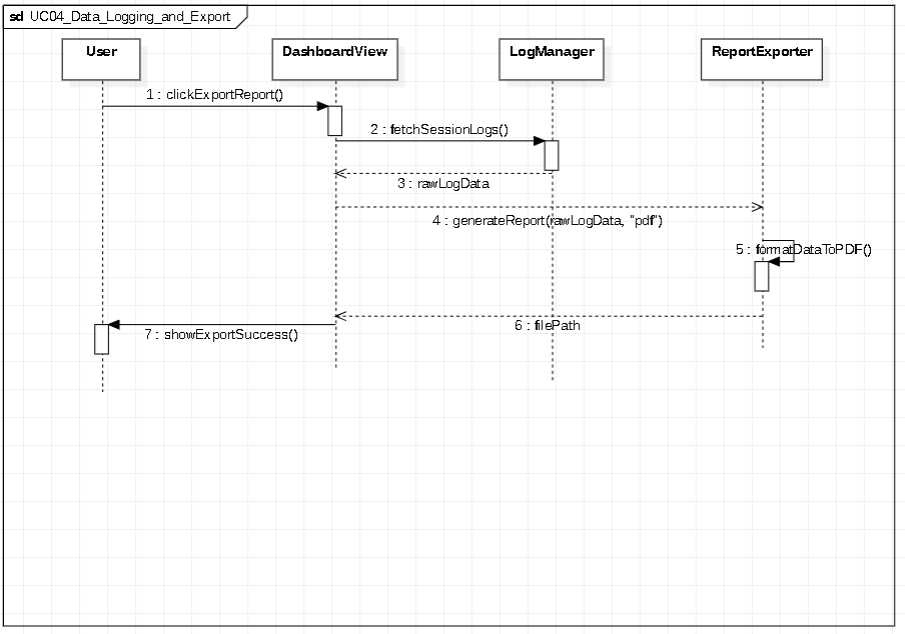
*<그림 6> Data Logging and Export Sequence diagram*

위 그림은 주행 데이터를 기록하고 분석용 PDF 보고서로 추출하는 과정이다. 사용자가 대시보드에서 `clickExportReport()`를 실행하면, `DashboardView`가 `LogManager`에서 현재 세션의 로그 데이터(`rawLogData`)를 가져온다. 이후 `ReportExporter`가 이 데이터를 넘겨받아 내부적으로 PDF 파일로 변환(`formatDataToPDF()`)하는 셀프 메시지 동작을 수행하고, 완료된 파일 경로를 반환하여 화면에 추출 성공 메시지를 띄운다.

### 3.5. Logout (UC05)

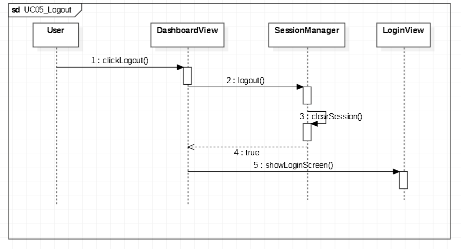
*<그림 7> Logout Sequence diagram*

위 그림은 시스템 접속을 종료하고 안전하게 로그아웃하는 과정이다. 사용자가 대시보드에서 로그아웃 버튼을 클릭하면, `DashboardView`가 `SessionManager`에 로그아웃 처리를 요청한다. `SessionManager`는 자체적으로 세션 정보를 삭제(`clearSession()`)하여 연결을 끊은 뒤 성공 여부를 반환하며, 이후 화면이 다시 초기 상태인 `LoginView`로 전환된다.

### 3.6. Set Thresholds (UC06)

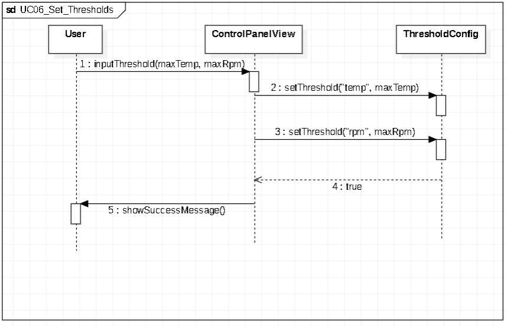
*<그림 8> Set Thresholds Sequence diagram*

위 그림은 사용자가 수동으로 차량 데이터의 위험 경고 임계값을 설정하는 과정이다. 사용자가 제어 패널(`ControlPanelView`)에서 최대 온도 및 RPM 등의 제한값을 입력하면, `ThresholdConfig` 클래스에 각각의 값을 연속적으로 업데이트(`setThreshold`)한다. 값이 정상적으로 저장되면 완료 결과를 반환하여 화면에 성공 메시지를 띄운다.

### 3.7. Emergency Stop (UC07)

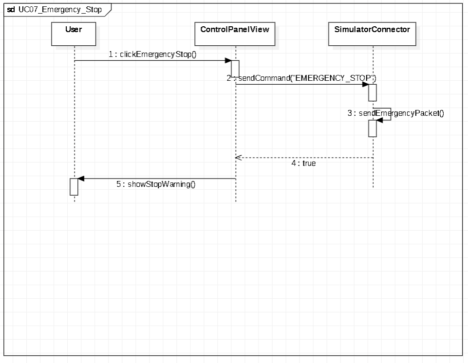
*<그림 9> Emergency Stop Sequence diagram*

위 그림은 차량 이상 발생 시 시스템에서 긴급 정지 명령을 내리는 제어 과정이다. 사용자가 긴급 정지 버튼을 누르면 `ControlPanelView`에서 `SimulatorConnector`로 정지 명령(EMERGENCY_STOP)을 전달한다. 커넥터는 네트워크 단에서 내부적으로 긴급 패킷을 생성하여 서버로 전송(`sendEmergencyPacket()`)하는 셀프 동작을 수행하고, 그 결과를 반환받아 화면에 긴급 정지 경고를 출력한다.

### 3.8. Battery Analysis (UC08)

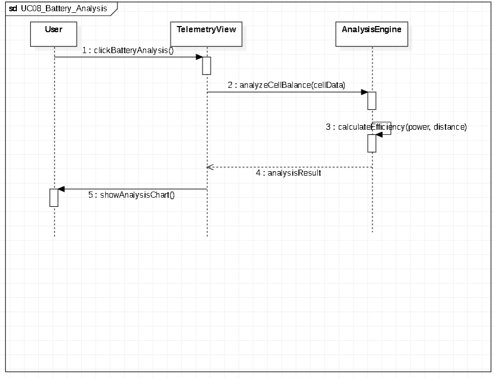
*<그림 10> Battery Analysis Sequence diagram*

위 그림은 차량의 배터리 셀 데이터를 바탕으로 밸런싱 및 전비 효율을 분석하는 과정이다. 사용자가 `TelemetryView`에서 배터리 분석을 요청하면, `AnalysisEngine`이 현재의 배터리 셀 데이터를 전달받는다. 이후 엔진 내부적으로 전력 소모량과 주행 거리를 바탕으로 효율을 계산(`calculateEfficiency()`)하며, 도출된 분석 결과 객체를 UI로 반환하여 시각적인 차트 형태로 사용자에게 제공한다.

### 3.9. Manual Logging Control (UC09)

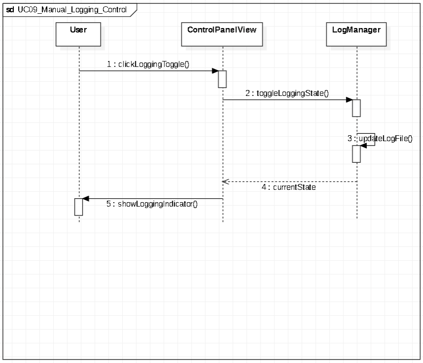
*<그림 11> Manual Logging Control Sequence diagram*

위 그림은 필요할 때만 주행 데이터를 기록할 수 있도록 수동으로 데이터 로깅 스위치를 제어하는 토글(Toggle) 과정이다. `ControlPanelView`에서 녹화 토글 버튼을 클릭하면 `LogManager`가 호출되어 현재 로깅 상태를 반전시킨다. `LogManager`는 내부적으로 로그 파일을 새로 열거나 닫는 작업(`updateLogFile()`)을 처리한 뒤 현재 상태(On/Off)를 반환하여 화면의 녹화 상태 표시기를 업데이트한다.

### 3.10. Load Scenario (UC10)

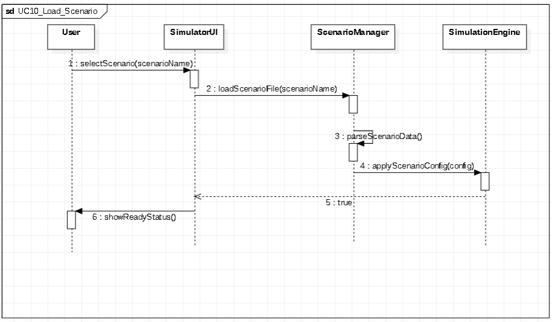
*<그림 12> Load Scenario Sequence diagram*

위 그림은 가상 주행을 위해 특정 시뮬레이션 시나리오(예: 고속도로, 악천후 주행)를 로드하고 엔진에 적용하는 서버 사이드 과정이다. 사용자가 `SimulatorUI`에서 시나리오를 선택하면 `ScenarioManager`가 해당 파일을 읽어 들여 시스템이 이해할 수 있도록 파싱(`parseScenarioData()`)한다. 파싱된 설정값은 `SimulationEngine`에 적용(`applyScenarioConfig()`)되며, 적용이 성공적으로 완료되면 준비 완료 상태를 UI에 알린다.

### 3.11. Server Start (UC11)

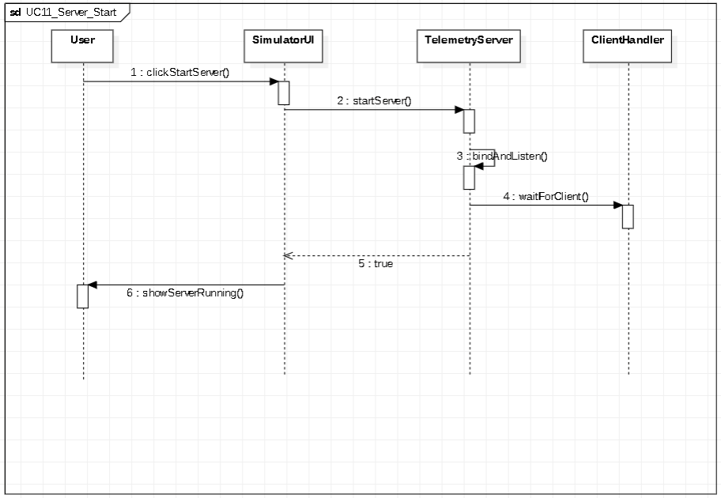
*<그림 13> Server Start Sequence diagram*

위 그림은 V-Map 시스템의 심장인 텔레메트리 서버를 가동하고 클라이언트 접속을 대기하는 초기화 과정이다. 관리자가 `SimulatorUI`에서 서버 가동을 요청하면 `TelemetryServer`가 구동된다. 서버는 내부적으로 지정된 포트를 열어 바인딩(`bindAndListen()`)한 뒤, `ClientHandler` 객체를 통해 클라이언트 접속 대기(`waitForClient()`) 모드로 돌입하며 화면에 서버 가동 중임을 띄운다.

  
## 4. State machine diagram

### 4.1. Client State Machine
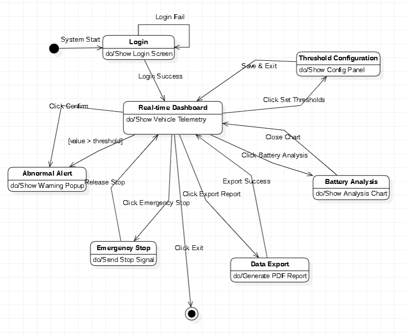
*<그림 14> Client State Machine diagram*

위 그림은 V-Map 클라이언트 앱의 상태 전이를 보여준다. 시스템 시작 후 로그인 화면을 거쳐 메인 대시보드 상태로 진입한다. 대시보드 상태에서는 위험 감지, 임계값 설정, 데이터 로그 추출 등 5가지 주요 기능 상태로 전이할 수 있으며, 각 작업 완료 시 다시 대시보드로 복귀하는 허브-스포크 구조를 가진다.

### 4.2. Server State Machine
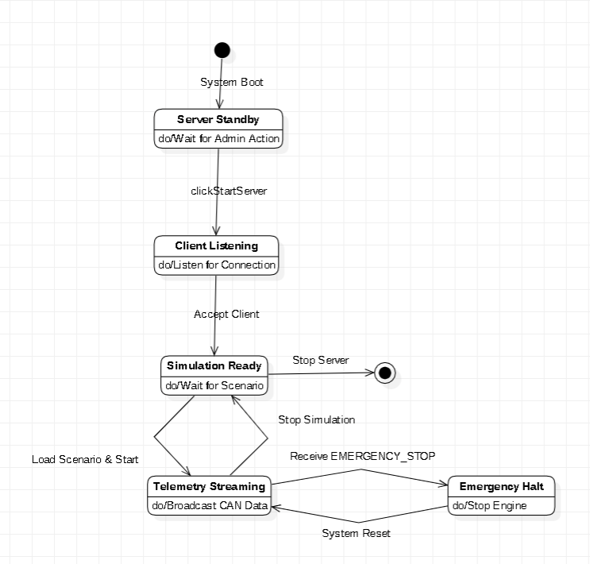
*<그림 15> Server State Machine diagram*

위 그림은 서버 시뮬레이터의 상태 전이를 나타낸다. 서버는 부팅 후 접속 대기 상태(Standby/Listening)를 거쳐 시뮬레이션 준비 상태가 된다. 시나리오 로드 후 실제 주행 데이터를 송신하는 스트리밍(Streaming) 상태로 전환되며, 긴급 정지 명령(EMERGENCY_STOP) 수신 시 제어 엔진을 중단하는 긴급 정지 상태로 전이 후 시스템 리셋을 통해 다시 준비 상태로 복귀할 수 있다.

| 상태 (State) | 주요 동작 (do Activity) | 설명 |
| :--- | :--- | :--- |
| **Server Standby** | `Wait for Admin Action` | 서버가 부팅된 후 관리자의 가동 명령을 대기하는 초기 상태 |
| **Client Listening** | `Listen for Connection` | 클라이언트의 접속 요청을 허용하기 위해 포트를 개방하고 대기함 |
| **Simulation Ready** | `Wait for Scenario` | 시뮬레이션 환경 구축이 완료되어 시나리오 로드 명령을 대기함 |
| **Telemetry Streaming** | `Broadcast CAN Data` | 차량의 CAN 데이터를 실시간으로 파싱하여 클라이언트로 전송함 |
| **Emergency Halt** | `Stop Engine` | 긴급 명령 수신 시 즉시 모든 시뮬레이션 엔진 동작을 정지함 |

  
## 5. Implementation requirements

### 5.1. System Development Environment
* **Development OS:** Windows 10/11 64-bit, Ubuntu 22.04 LTS
* **Integrated Development Environment (IDE):** Visual Studio Code
* **Implementation Language:**  Python 3.8+ (Server), HTML5/JavaScript (Client)
* **Framework:** Python 표준 라이브러리 http.server (HTTP/SSE 서버), Canvas API (게이지·실시간 차트 시각화) — 외부 패키지 없이 실행 환경 독립성 확보

### 5.2. Simulation Environment (Software-in-the-Loop)
본 시스템은 실제 하드웨어 없이도 동작을 검증할 수 있는 **SITL(Software-in-the-Loop) 기반의 가상 환경**을 구축하여 구현하였다.
* **CanPacketBuilder:** 실제 CAN 컨트롤러 대신 소프트웨어 패킷 생성기를 통해 통신 프로토콜을 모사함.
* **SensorMockup:** 하드웨어 센서 대신 가상 데이터 생성 알고리즘을 사용하여 차량 상태(Speed, RPM, SOC)를 실시간 연산함.
* **TelemetryServer/Client:** HTTP/SSE 기반 통신(로컬 및 공개 서버 배포 검증)을 통해 클라이언트-서버 간의 실시간 통신 로직을 완벽히 구현 및 검증함.

  
## 6. Glossary

* **CAN (Controller Area Network):** 차량 내 전자 제어 장치 간 통신을 위해 설계된 메시지 기반의 통신 프로토콜.
* **Telemetry:** 차량의 센서 데이터, 속도, 상태 정보를 원격지 서버로 실시간 전송하고 모니터링하는 기술.
* **Socket Programming:** 네트워크를 통해 서버와 클라이언트 간 데이터를 주고받기 위한 통신 종단점 프로그래밍 기법.
* **Threshold:** 주행 중 위험 상황 판단을 위해 시스템에 설정된 데이터 상한/하한값.
* **Parsing:** 서버로부터 수신된 원시(Raw) 데이터를 시스템이 이해할 수 있는 객체나 규격으로 변환하는 과정.
* **State Transition:** 시스템의 상태가 외부 트리거(이벤트)에 의해 다른 상태로 이동하는 논리적 변화 과정.

  
## 7. References

1. **CAN Specification 2.0B**, Robert Bosch GmbH.
2. **Qt 6 Framework Documentation**, The Qt Company (https://doc.qt.io).
3. **C++ Standard (ISO/IEC 14882:2020)**, International Organization for Standardization.
4. **V-Map Project Repository**, Internal Technical Report (2026).
5. **Real-Time Embedded Systems Design**, Academic Press, 2024.
